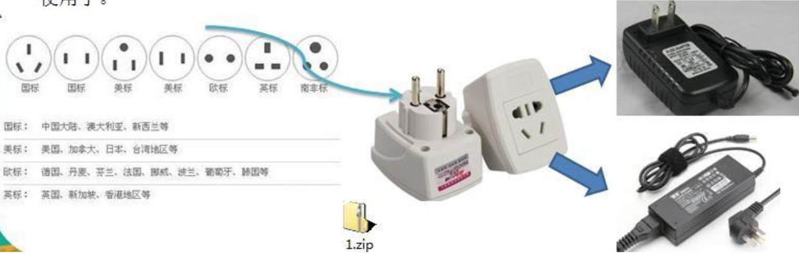

# Adapter Mode

> 现实生活中的适配器例子

泰国插座用的是两孔的（欧标），可以买个多功能转换插头 (适配器) ，这样就可以使用了



---

> 适配器基本介绍

1. 适配器模式(Adapter Pattern)将某个类的接口转换成客户端期望的另一个接口表示，主的目的是兼容性，让原本因接口不匹配不能一起工作的两个类可以协同工作。其别名为包装器(Wrapper)
2. 适配器模式属于结构型模式
3. 主要分为三类：类适配器模式、对象适配器模式、接口适配器模式

---

> 适配器工作原理

1. 适配器模式：将一个类的接口转换成另一种接口.让原本接口不兼容的类可以兼容
2. 从用户的角度看不到被适配者，是解耦的
3. 用户调用适配器转化出来的目标接口方法，适配器再调用被适配者的相关接口方法
4. 用户收到反馈结果，感觉只是和目标接口交互

---

> 类适配器模式

基本介绍：Adapter 类，通过继承 src 类，实现 dst 类接口，完成 src → dst 的适配

实例说明：以生活中充电器的例子来讲解适配器，充电器本身相当于 Adapter， 220V 交流电相当于 src (即被适配者)，我们的目 dst(即 目标)是 5V 直流电

代码实现：

```java
package pers.ditto.classadapter;

/**
 * @author OrangeCH3
 * @create 2021-07-16 10:02
 */

@SuppressWarnings("all")
public class Voltage220V {

    //输出220V的电压
    public int output220V() {
        int src = 220;
        System.out.println("适配前电压 = " + src + "伏");
        return src;
    }
}
```

```java
package pers.ditto.classadapter;

/**
 * @author OrangeCH3
 * @create 2021-07-16 10:03
 */

@SuppressWarnings("all")
public interface IVoltage5V {

    public int output5V();
}
```

```java
package pers.ditto.classadapter;

/**
 * @author OrangeCH3
 * @create 2021-07-16 10:04
 */


//适配器类
@SuppressWarnings("all")
public class VoltageAdapter extends Voltage220V implements IVoltage5V {

    @Override
    public int output5V() {
        //获取到220V电压
        int srcV = output220V();
        int dstV = srcV / 44 ; //转成 5v
        return dstV;
    }

}
```

```java
package pers.ditto.classadapter;

/**
 * @author OrangeCH3
 * @create 2021-07-16 10:05
 */

@SuppressWarnings("all")
public class Phone {

    //充电
    public void charging(IVoltage5V iVoltage5V) {
        if(iVoltage5V.output5V() == 5) {
            System.out.println("电压为5V, 可以充电");
        } else if (iVoltage5V.output5V() > 5) {
            System.out.println("电压大于5V, 不能充电");
        }
    }
}
```

```java
package pers.ditto.classadapter;

import org.junit.Test;

/**
 * @author OrangeCH3
 * @create 2021-07-16 10:06
 */

@SuppressWarnings("all")
public class Client {

    @Test
    public void test () {
        System.out.println(" === 类适配器模式 ===");
        Phone phone = new Phone();
        phone.charging(new VoltageAdapter());
    }
}
```

类适配器模式注意事项和细节:

1. Java 是单继承机制，所以类适配器需要继承 src 类这一点算是一个缺点, 因为要求 dst 必须是接口，有一定局限性
2. src 类的方法在 Adapter 中都会暴露出来，也增加了使用的成本
3. 由于其继承了 src 类，所以它可以根据需求重写 src 类的方法，使得 Adapter 的灵活性增强了

---

> 对象适配器模式

对象适配器模式介绍：

1. 基本思路和类的适配器模式相同，只是将 Adapter 类作修改，不是继承 src 类，而是持有 src 类的实例，以解决兼容性的问题。 即：持有 src 类，实现 dst 类接口，完成 src->dst 的适配
2. 根据“合成复用原则”，在系统中尽量使用关联关系（聚合）来替代继承关系
3. 对象适配器模式是适配器模式常用的一种

应用实例说明:

- 以生活中充电器的例子来讲解适配器，充电器本身相当于 Adapter， 220V 交流电相当于 src (即被适配者)，我们的目 dst(即目标)是 5V 直流电，使用对象适配器模式完成

代码实现：

```java
package pers.ditto.objectadapter;

/**
 * @author OrangeCH3
 * @create 2021-07-16 10:18
 */

//被适配的类
@SuppressWarnings("all")
public class Voltage220V {
    //输出220V的电压，不变
    public int output220V() {
        int src = 220;
        System.out.println("电压=" + src + "伏");
        return src;
    }
}
```

```java
package pers.ditto.objectadapter;

/**
 * @author OrangeCH3
 * @create 2021-07-16 10:19
 */

//适配接口
@SuppressWarnings("all")
public interface IVoltage5V {
    public int output5V();
}
```

```java
package pers.ditto.objectadapter;


/**
 * @author OrangeCH3
 * @create 2021-07-16 10:21
 */

@SuppressWarnings("all")
//适配器类
public class VoltageAdapter  implements IVoltage5V {

    private Voltage220V voltage220V; // 关联关系-聚合


    //通过构造器，传入一个 Voltage220V 实例
    public VoltageAdapter(Voltage220V voltage220v) {

        this.voltage220V = voltage220v;
    }


    @Override
    public int output5V() {

        int dst = 0;
        if(null != voltage220V) {
            int src = voltage220V.output220V();//获取220V 电压
            System.out.println("使用对象适配器，进行适配");
            dst = src / 44;
            System.out.println("适配完成，输出的电压为=" + dst);
        }

        return dst;

    }

}
```

```java
package pers.ditto.objectadapter;

/**
 * @author OrangeCH3
 * @create 2021-07-16 10:22
 */

@SuppressWarnings("all")
public class Phone {

    //充电
    public void charging(IVoltage5V iVoltage5V) {
        if(iVoltage5V.output5V() == 5) {
            System.out.println("电压为5V, 可以充电");
        } else if (iVoltage5V.output5V() > 5) {
            System.out.println("电压大于5V, 不能充电");
        }
    }
}
```

```java
package pers.ditto.objectadapter;

import org.junit.Test;

/**
 * @author OrangeCH3
 * @create 2021-07-16 10:22
 */

@SuppressWarnings("all")
public class Client {

    @Test
    public void test() {

        System.out.println(" === 对象适配器模式 ====");
        Phone phone = new Phone();
        phone.charging(new VoltageAdapter(new Voltage220V()));
    }
}
```

对象适配器模式注意事项和细节：

1. 对象适配器和类适配器其实算是同一种思想，只不过实现方式不同
2. 根据合成复用原则，使用组合替代继承， 所以它解决了类适配器必须继承 src 的局限性问题，也不再要求 dst 必须是接口
3. 使用成本更低，更灵活

---

> 接口适配器模式

接口适配器模式介绍：

1. 一些书籍称为：默认适配器模式(Default Adapter Pattern)或缺省适配器模式
2. 核心思路：当不需要全部实现接口提供的方法时，可先设计一个抽象类实现接口，并为该接口中每个方法提供一个默认实现（空方法），那么该抽象类的子类可有选择地覆盖父类的某些方法来实现需求
3. 用于一个接口不想使用其所有的方法的情况

代码实现：

```java
package pers.ditto.interfaceadapter;

/**
 * @author OrangeCH3
 * @create 2021-07-16 10:31
 */

@SuppressWarnings("all")
public interface InterfaceAll {

    public void m1();
    public void m2();
    public void m3();
    public void m4();
}
```

```java
package pers.ditto.interfaceadapter;

/**
 * @author OrangeCH3
 * @create 2021-07-16 10:32
 */

@SuppressWarnings("all")
public abstract class AbsAdapter implements InterfaceAll{

    //默认实现
    public void m1() {

    }

    public void m2() {

    }

    public void m3() {

    }

    public void m4() {

    }
}
```

```java
package pers.ditto.interfaceadapter;

import org.junit.Test;

/**
 * @author OrangeCH3
 * @create 2021-07-16 10:34
 */

@SuppressWarnings("all")
public class Client {

    @Test
    public void test() {

        AbsAdapter absAdapter = new AbsAdapter() {

            @Override
            public void m1() {
                System.out.println("使用了m1的方法");
            }
        };

        absAdapter.m1();
    }
}
```

适配器模式的注意事项和细节：

1. 三种命名方式，是根据 src 是以怎样的形式给到 Adapter（在 Adapter 里的形式）来命名的
2. 1. 类适配器：以类给到，在 Adapter 里，就是将 src 当做类，继承
   2. 对象适配器：以对象给到，在 Adapter 里，将 src 作为一个对象，持有
   3. 接口适配器：以接口给到，在 Adapter 里，将 src 作为一个接口，实现
3. Adapter 模式最大的作用还是将原本不兼容的接口融合在一起工作
4. 实际开发中，实现起来不拘泥于这三种经典形式
