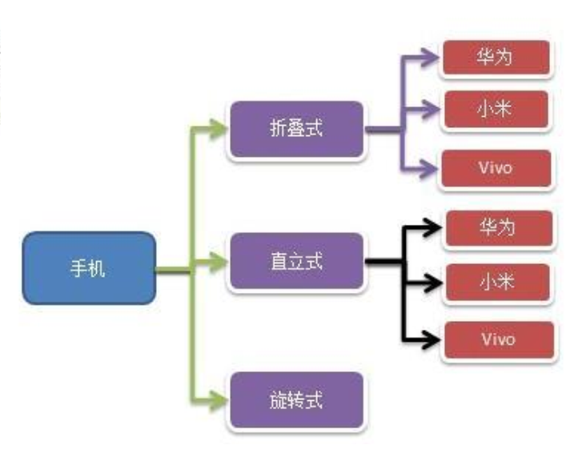

# Bridge Mode

> 传统方式解决手机操作问题

现在对不同手机类型的不同品牌实现操作编程(比如:开机、关机、上网，打电话等)，如图:



传统方案解决手机操作问题分析：

1. 扩展性问题(类爆炸)，如果我们再增加手机的样式(旋转式)，就需要增加各个品牌手机的类，同样如果我们增加一个手机品牌，也要在各个手机样式类下增加
2. 违反了单一职责原则，当我们增加手机样式时，要同时增加所有品牌的手机，这样增加了代码维护成本
3. 改进方案：使用桥接模式

---

> 桥接模式(Bridge)解决手机操作问题

基本介绍：

1. 桥接模式(Bridge 模式)是指：将实现与抽象放在两个不同的类层次中，使两个层次可以独立改变
2. 是一种结构型设计模式
3. Bridge 模式基于类的最小设计原则，通过使用封装、聚合及继承等行为让不同的类承担不同的职责。它的主要特点是把抽象(Abstraction)与行为实现(Implementation)分离开来，从而可以保持各部分的独立性以及应对他们的功能扩展

原理UML类图：


示例代码：

```java

```


