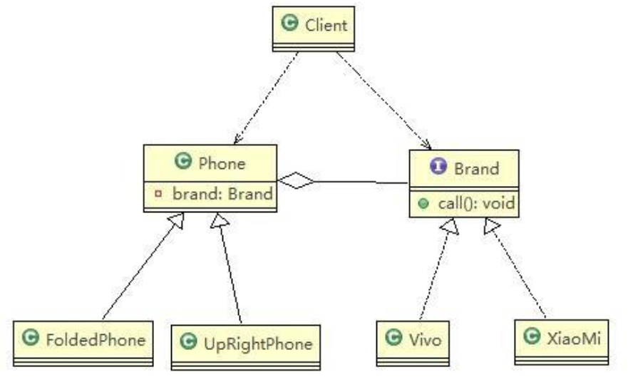

# Bridge Mode

> 传统方式解决手机操作问题

现在对不同手机类型的不同品牌实现操作编程(比如:开机、关机、上网，打电话等)，如图:


传统方案解决手机操作问题分析：

1. 扩展性问题(类爆炸)，如果我们再增加手机的样式(旋转式)，就需要增加各个品牌手机的类，同样如果我们增加一个手机品牌，也要在各个手机样式类下增加
2. 违反了单一职责原则，当我们增加手机样式时，要同时增加所有品牌的手机，这样增加了代码维护成本
3. 改进方案：使用桥接模式

---

> 桥接模式(Bridge)解决手机操作问题

基本介绍：

1. 桥接模式(Bridge 模式)是指：将实现与抽象放在两个不同的类层次中，使两个层次可以独立改变
2. 是一种结构型设计模式
3. Bridge 模式基于类的最小设计原则，通过使用封装、聚合及继承等行为让不同的类承担不同的职责。它的主要特点是把抽象(Abstraction)与行为实现(Implementation)分离开来，从而可以保持各部分的独立性以及应对他们的功能扩展

原理UML类图：



示例代码：

```java
package pers.ditto.bridge;

/**
 * @author OrangeCH3
 * @create 2021-07-17 9:55
 */

@SuppressWarnings("all")
public interface Brand {
    void open();
    void close();
    void call();
}
```

```java
package pers.ditto.bridge;

/**
 * @author OrangeCH3
 * @create 2021-07-17 9:56
 */

@SuppressWarnings("all")
public class Phone {

    //组合品牌
    private Brand brand;

    //构造器
    public Phone(Brand brand) {
        super();
        this.brand = brand;
    }

    protected void open() {
        brand.open();
    }
    protected void close() {
        brand.close();
    }
    protected void call() {
        brand.call();
    }
}
```

```java
package pers.ditto.bridge;

/**
 * @author OrangeCH3
 * @create 2021-07-17 9:56
 */

@SuppressWarnings("all")
public class Vivo implements Brand{
    @Override
    public void open() {
        System.out.println(" Vivo手机开机 ");
    }

    @Override
    public void close() {
        System.out.println(" Vivo手机关机 ");
    }

    @Override
    public void call() {
        System.out.println(" Vivo手机打电话 ");
    }
}
```

```java
package pers.ditto.bridge;

/**
 * @author OrangeCH3
 * @create 2021-07-17 9:57
 */

@SuppressWarnings("all")
public class XiaoMi implements Brand{
    @Override
    public void open() {
        System.out.println(" 小米手机开机 ");
    }

    @Override
    public void close() {
        System.out.println(" 小米手机关机 ");
    }

    @Override
    public void call() {
        System.out.println(" 小米手机打电话 ");
    }
}
```

```java
package pers.ditto.bridge;

/**
 * @author OrangeCH3
 * @create 2021-07-17 9:58
 */

@SuppressWarnings("all")
public class FoldedPhone extends Phone {

    public FoldedPhone(Brand brand) {
        super(brand);
    }

    public void open() {

        System.out.print(" 折叠样式 →");
        super.open();
    }

    public void close() {

        System.out.print(" 折叠样式 →");
        super.close();
    }

    public void call() {

        System.out.print(" 折叠样式 →");
        super.call();
    }
}
```

```java
package pers.ditto.bridge;

/**
 * @author OrangeCH3
 * @create 2021-07-17 10:00
 */

@SuppressWarnings("all")
public class UpRightPhone extends Phone {

    public UpRightPhone(Brand brand) {
        super(brand);
    }

    public void open() {

        System.out.print(" 直板样式 →");
        super.open();
    }

    public void close() {

        System.out.print(" 直板样式 →");
        super.close();
    }

    public void call() {

        System.out.print(" 直板样式 →");
        super.call();
    }
}
```

```java
package pers.ditto.bridge;

import org.junit.Test;

/**
 * @author OrangeCH3
 * @create 2021-07-17 10:01
 */

@SuppressWarnings("all")
public class ClientB {

    @Test
    public void testBridge() {

        //获取折叠式手机 (样式 + 品牌 )

        Phone phone1 = new FoldedPhone(new XiaoMi());

        phone1.open();
        phone1.call();
        phone1.close();

        System.out.println();

        Phone phone2 = new FoldedPhone(new Vivo());

        phone2.open();
        phone2.call();
        phone2.close();

        System.out.println();

        Phone phone3 = new UpRightPhone(new XiaoMi());

        phone3.open();
        phone3.call();
        phone3.close();

        System.out.println();

        Phone phone4 = new UpRightPhone(new Vivo());

        phone4.open();
        phone4.call();
        phone4.close();
    }
}
```

```java
/* 输出结果为：
        折叠样式 → 小米手机开机
        折叠样式 → 小米手机打电话
        折叠样式 → 小米手机关机

        折叠样式 → Vivo手机开机
        折叠样式 → Vivo手机打电话
        折叠样式 → Vivo手机关机

        直板样式 → 小米手机开机
        直板样式 → 小米手机打电话
        直板样式 → 小米手机关机

        直板样式 → Vivo手机开机
        直板样式 → Vivo手机打电话
        直板样式 → Vivo手机关机

        Process finished with exit code 0
*/
```

桥接模式的注意事项和细节：

1. 实现了抽象和实现部分的分离，从而极大的提供了系统的灵活性，让抽象部分和实现部分独立开来，这有助于系统进行分层设计，从而产生更好的结构化系统
2. 对于系统的高层部分，只需要知道抽象部分和实现部分的接口就可以了，其它的部分由具体业务来完成
3. 桥接模式替代多层继承方案，可以减少子类的个数，降低系统的管理和维护成本
4. 桥接模式的引入增加了系统的理解和设计难度，由于聚合关联关系建立在抽象层，要求开发者针对抽象进行设计和编程
5. 桥接模式要求正确识别出系统中两个独立变化的维度(抽象、和实现)，因此其使用范围有一定的局限性，即需要有这样的应用场景

桥接模式其它应用场景：

对于那些不希望使用继承或因为多层次继承导致系统类的个数急剧增加的系统，桥接模式尤为适用

1. JDBC 驱动程序
2. 银行转账系统
   1. 转账分类: 网上转账，柜台转账， AMT 转账
   2. 转账用户类型：普通用户，银卡用户，金卡用户
3. 消息管理
   1. 消息类型：即时消息，延时消息
   2. 消息分类：手机短信，邮件消息， QQ 消息
