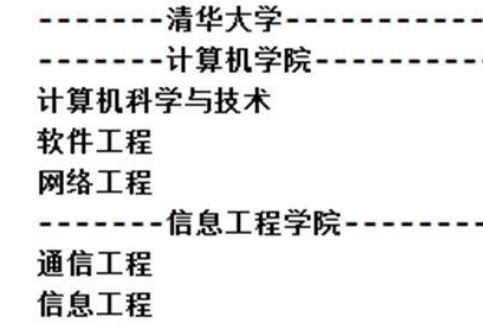
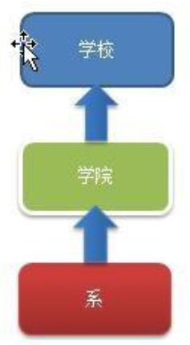
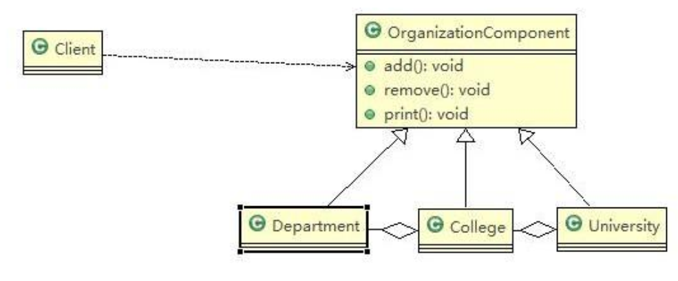

# Combination Mode

> 学校院系展示需求

编写程序展示一个学校院系结构：需求是这样，要在一个页面中展示出学校的院系组成，一个学校有多个学院， 一个学院有多个系。如图：



---

> 传统方法解决学校院系展示问题



传统方案解决学校院系展示存在的问题分析：

1. 将学院看做是学校的子类，系是学院的子类，这样实际上是站在组织大小来进行分层次的
2. 实际上我们的要求是 ：在一个页面中展示出学校的院系组成，一个学校有多个学院，一个学院有多个系， 因此这种方案，不能很好实现的管理的操作，比如对学院、系的添加，删除，遍历等
3. 解决方案：把学校、院、系都看做是组织结构，他们之间没有继承的关系，而是一个树形结构，可以更好的实现管理操作

---

> 组合模式解决学校院系展示问题

基本介绍：

1. 组合模式（Composite Pattern），又叫部分整体模式，它创建了对象组的树形结构，将对象组合成树状结构以表示“整体-部分”的层次关系
2. 组合模式依据树形结构来组合对象，用来表示部分以及整体层次
3. 这种类型的设计模式属于结构型模式
4. 组合模式使得用户对单个对象和组合对象的访问具有一致性，即：组合能让客户以一致的方式处理个别对象以及组合对象

原理类图：



代码实现：

```java
package pers.ditto.combination;

import lombok.AllArgsConstructor;
import lombok.Data;
import lombok.NoArgsConstructor;

/**
 * @author OrangeCH3
 * @create 2021-07-20 10:51
 */

@SuppressWarnings("all")
@AllArgsConstructor
@NoArgsConstructor
@Data
public abstract class OrganizationComponent {

    private String name; // 名字
    private String des; // 说明

    protected  void add(OrganizationComponent organizationComponent) {
        //默认实现
        throw new UnsupportedOperationException();
    }

    protected  void remove(OrganizationComponent organizationComponent) {
        //默认实现
        throw new UnsupportedOperationException();
    }

    //方法print, 做成抽象的, 子类都需要实现
    protected abstract void print();
}
```

```java
package pers.ditto.combination;

import java.util.ArrayList;
import java.util.List;

/**
 * @author OrangeCH3
 * @create 2021-07-20 10:54
 */

@SuppressWarnings("all")
public class University extends OrganizationComponent{

    List<OrganizationComponent> organizationComponents = new ArrayList<>();

    // 构造器
    public University(String name, String des) {
        super(name, des);
    }

    // 重写add
    @Override
    protected void add(OrganizationComponent organizationComponent) {
        organizationComponents.add(organizationComponent);
    }

    // 重写remove
    @Override
    protected void remove(OrganizationComponent organizationComponent) {
        organizationComponents.remove(organizationComponent);
    }

    @Override
    protected void print() {

        System.out.println("★ University: " + getName() + " |" + getDes());
        //遍历 organizationComponents
        for (OrganizationComponent organizationComponent : organizationComponents) {
            organizationComponent.print();
        }
    }
}
```

```java
package pers.ditto.combination;

import java.util.ArrayList;
import java.util.List;

/**
 * @author OrangeCH3
 * @create 2021-07-20 11:00
 */

@SuppressWarnings("all")
public class College extends OrganizationComponent{

    //List 中 存放的Department
    List<OrganizationComponent> organizationComponents = new ArrayList<>();

    // 构造器
    public College(String name, String des) {
        super(name, des);
    }

    // 重写add
    @Override
    protected void add(OrganizationComponent organizationComponent) {
        //  将来实际业务中，Colleage 的 add 和  University add 不一定完全一样
        organizationComponents.add(organizationComponent);
    }

    // 重写remove
    @Override
    protected void remove(OrganizationComponent organizationComponent) {
        organizationComponents.remove(organizationComponent);
    }


    @Override
    protected void print() {

        System.out.println();
        System.out.println("■ College: " + getName() + " |" + getDes());
        //遍历 organizationComponents
        for (OrganizationComponent organizationComponent : organizationComponents) {
            organizationComponent.print();
        }
    }
}
```

```java
package pers.ditto.combination;

/**
 * @author OrangeCH3
 * @create 2021-07-20 11:02
 */

@SuppressWarnings("all")
public class Department extends OrganizationComponent{

    //没有集合

    public Department(String name, String des) {
        super(name, des);
    }

    //add(), remove()方法不用重写, 因为是叶子节点

    @Override
    protected void print() {
        System.out.println("▲ Department: " + getName() + " |" + getDes());
    }
}
```

```java
package pers.ditto.combination;

import org.junit.Test;

/**
 * @author OrangeCH3
 * @create 2021-07-20 11:04
 */

@SuppressWarnings("all")
public class ClientCom {

    @Test
    public void testCom() {

        //从大到小创建对象 学校
        OrganizationComponent university = new University("清华大学", " 中国顶级大学 ");

        //创建 学院
        OrganizationComponent computerCollege = new College("计算机学院", " 计算机学院 ");
        OrganizationComponent infoEngineercollege = new College("信息工程学院", " 信息工程学院 ");


        //创建各个学院下面的系(专业)
        computerCollege.add(new Department("软件工程", " 软件工程不错 "));
        computerCollege.add(new Department("网络工程", " 网络工程不错 "));
        computerCollege.add(new Department("计算机科学与技术", " 计算机科学与技术是老牌的专业 "));

        //
        infoEngineercollege.add(new Department("通信工程", " 通信工程不好学 "));
        infoEngineercollege.add(new Department("信息工程", " 信息工程好学 "));

        //将学院加入到 学校
        university.add(computerCollege);
        university.add(infoEngineercollege);

        //university.print();
        university.print();
    }
}
```

```java
/* 输出结果为：
        ★ University: 清华大学 | 中国顶级大学 

        ■ College: 计算机学院 | 计算机学院 
        ▲ Department: 软件工程 | 软件工程不错 
        ▲ Department: 网络工程 | 网络工程不错 
        ▲ Department: 计算机科学与技术 | 计算机科学与技术是老牌的专业 

        ■ College: 信息工程学院 | 信息工程学院 
        ▲ Department: 通信工程 | 通信工程不好学 
        ▲ Department: 信息工程 | 信息工程好学 

        Process finished with exit code 0
*/
```

组合模式的注意事项和细节:

1. 简化客户端操作。客户端只需要面对一致的对象而不用考虑整体部分或者节点叶子的问题
2. 具有较强的扩展性。当我们要更改组合对象时，我们只需要调整内部的层次关系，客户端不用做出任何改动
3. 方便创建出复杂的层次结构。客户端不用理会组合里面的组成细节，容易添加节点或者叶子从而创建出复杂的树形结构
4. 需要遍历组织机构，或者处理的对象具有树形结构时, 非常适合使用组合模式
5. 要求较高的抽象性，如果节点和叶子有很多差异性的话，比如很多方法和属性都不一样，不适合使用组合模式
