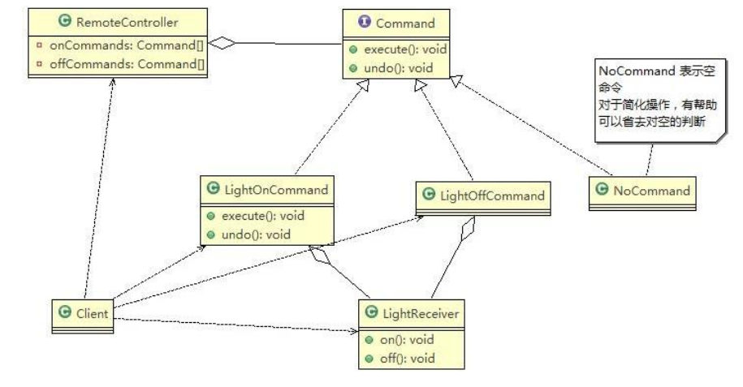

# Command Mode

> 智能生活项目需求


1. 我们买了一套智能家电，有照明灯、风扇、冰箱、洗衣机，我们只要在手机上安装 app 就可以控制对这些家电工作
2. 这些智能家电来自不同的厂家，我们不想针对每一种家电都安装一个 App，分别控制，我们希望只要一个 app就可以控制全部智能家电
3. 要实现一个 app 控制所有智能家电的需要，则每个智能家电厂家都要提供一个统一的接口给 app 调用，这时就可以考虑使用命令模式
4. 命令模式可将“动作的请求者”从“动作的执行者”对象中解耦出来
5. 在我们的例子中，动作的请求者是手机 app，动作的执行者是每个厂商的一个家电产品

> 命令模式解决智能家居项目

基本介绍：

1. 命令模式（Command Pattern） ：在软件设计中，我们经常需要向某些对象发送请求，但是并不知道请求的接收者是谁，也不知道被请求的操作是哪个，我们只需在程序运行时指定具体的请求接收者即可，此时，可以使用命令模式来进行设计
2. 命令模式使得请求发送者与请求接收者消除彼此之间的耦合，让对象之间的调用关系更加灵活，实现解耦
3. 在命令模式中，会将一个请求封装为一个对象，以便使用不同参数来表示不同的请求(即命令)，同时命令模式也支持可撤销的操作
4. 将军发布命令，士兵去执行。其中有几个角色：将军（命令发布者） 、士兵（命令的具体执行者）、命令(连接将军和士兵)
5. Invoker 是调用者（将军）， Receiver 是被调用者（士兵）， MyCommand 是命令，实现了 Command 接口，持有接收对象

原理类图：



代码实现：

```java
package pers.ditto.command;

/**
 * @author OrangeCH3
 * @create 2021-07-23 16:00
 */

@SuppressWarnings("all")
public interface Command {

    //执行动作(操作)
    public void execute();

    //撤销动作(操作)
    public void undo();
}
```

```java
package pers.ditto.command;

/**
 * @author OrangeCH3
 * @create 2021-07-23 16:01
 */

@SuppressWarnings("all")
public class LightReceiver {

    public void on() {
        System.out.println("电灯已打开");
    }

    public void off() {
        System.out.println("电灯已关闭");
    }
}
```

```java
package pers.ditto.command;

/**
 * @author OrangeCH3
 * @create 2021-07-23 16:01
 */

@SuppressWarnings("all")
public class LightOnCommand implements Command{

    //聚合LightReceiver
    LightReceiver light;

    //构造器
    public LightOnCommand(LightReceiver light) {
        super();
        this.light = light;
    }

    @Override
    public void execute() {
        light.on();
    }

    @Override
    public void undo() {
        light.off();
    }
}
```

```java
package pers.ditto.command;

/**
 * @author OrangeCH3
 * @create 2021-07-23 16:03
 */

@SuppressWarnings("all")
public class LightOffCommand implements Command{

    // 聚合LightReceiver
    LightReceiver light;

    // 构造器
    public LightOffCommand(LightReceiver light) {
        super();
        this.light = light;
    }

    @Override
    public void execute() {
        light.off();
    }

    @Override
    public void undo() {
        light.on();
    }
}
```

```java
package pers.ditto.command;

/**
 * @author OrangeCH3
 * @create 2021-07-23 16:04
 */

// 用于初始化每个按钮, 当调用空命令时，对象什么都不做
// 也算是一种设计模式, 可以省掉对空判断
@SuppressWarnings("all")
public class NoCommand implements Command{
    @Override
    public void execute() {
        // 空实现
    }

    @Override
    public void undo() {
        // 空实现
    }
}
```

```java
package pers.ditto.command;

/**
 * @author OrangeCH3
 * @create 2021-07-23 16:05
 */

@SuppressWarnings("all")
public class RemoteController {

    // 开 按钮的命令数组
    Command[] onCommands;
    Command[] offCommands;

    // 执行撤销的命令
    Command undoCommand;

    // 构造器，完成对按钮初始化
    public RemoteController() {

        onCommands = new Command[5];
        offCommands = new Command[5];

        for (int i = 0; i < 5; i++) {
            onCommands[i] = new NoCommand();
            offCommands[i] = new NoCommand();
        }
    }

    // 给我们的按钮设置你需要的命令
    public void setCommand(int no, Command onCommand, Command offCommand) {
        onCommands[no] = onCommand;
        offCommands[no] = offCommand;
    }

    // 按下开按钮
    public void onButtonWasPushed(int no) { // no 0
        // 找到你按下的开的按钮， 并调用对应方法
        onCommands[no].execute();
        // 记录这次的操作，用于撤销
        undoCommand = onCommands[no];

    }

    // 按下开按钮
    public void offButtonWasPushed(int no) { // no 0
        // 找到你按下的关的按钮， 并调用对应方法
        offCommands[no].execute();
        // 记录这次的操作，用于撤销
        undoCommand = offCommands[no];

    }

    // 按下撤销按钮
    public void undoButtonWasPushed() {
        undoCommand.undo();
    }
}
```

```java
package pers.ditto.command;

/**
 * @author OrangeCH3
 * @create 2021-07-23 16:13
 */

@SuppressWarnings("all")
public class TVReceiver {

    public void on() {
        System.out.println("电视已打开");
    }

    public void off() {
        System.out.println("电视已关闭");
    }
}
```

```java
package pers.ditto.command;

/**
 * @author OrangeCH3
 * @create 2021-07-23 16:13
 */

@SuppressWarnings("all")
public class TVOffCommand implements Command{

    // 聚合TVReceiver
    TVReceiver tv;

    // 构造器
    public TVOffCommand(TVReceiver tv) {
        super();
        this.tv = tv;
    }

    @Override
    public void execute() {
        tv.off();
    }

    @Override
    public void undo() {
        tv.on();
    }
}
```

```java
package pers.ditto.command;

/**
 * @author OrangeCH3
 * @create 2021-07-23 16:15
 */

@SuppressWarnings("all")
public class TVOnCommand implements Command {

    // 聚合TVReceiver
    TVReceiver tv;

    // 构造器
    public TVOnCommand(TVReceiver tv) {
        super();
        this.tv = tv;
    }

    @Override
    public void execute() {
        tv.on();
    }

    @Override
    public void undo() {
        tv.off();
    }
}
```

```java
package pers.ditto.command;

import org.junit.Test;

/**
 * @author OrangeCH3
 * @create 2021-07-23 16:07
 */

@SuppressWarnings("all")
public class ClientCommand {

    @Test
    public void testCommand() {

        //使用命令设计模式，完成通过遥控器，对电灯的操作

        //创建电灯的对象(接受者)
        LightReceiver lightReceiver = new LightReceiver();

        //创建电灯相关的开关命令
        LightOnCommand lightOnCommand = new LightOnCommand(lightReceiver);
        LightOffCommand lightOffCommand = new LightOffCommand(lightReceiver);

        //需要一个遥控器
        RemoteController remoteController = new RemoteController();

        //给我们的遥控器设置命令, 比如 no = 0 是电灯的开和关的操作
        remoteController.setCommand(0, lightOnCommand, lightOffCommand);

        System.out.println("按下电灯打开按钮 →");
        remoteController.onButtonWasPushed(0);
        System.out.println("按下电灯关闭按钮 →");
        remoteController.offButtonWasPushed(0);
        System.out.println("按下电灯撤销按钮 →");
        remoteController.undoButtonWasPushed();
        System.out.println();

        // 功能扩展也很容易，只需要增加XXOffCommand, XXOnCommand, XXReceiver即可
        TVReceiver tvReceiver = new TVReceiver();

        TVOffCommand tvOffCommand = new TVOffCommand(tvReceiver);
        TVOnCommand tvOnCommand = new TVOnCommand(tvReceiver);

        //给我们的遥控器设置命令, 比如 no = 1 是电视机的开和关的操作
        remoteController.setCommand(1, tvOnCommand, tvOffCommand);

        System.out.println("按下电视打开按钮 →");
        remoteController.onButtonWasPushed(1);
        System.out.println("按下电视关闭按钮 →");
        remoteController.offButtonWasPushed(1);
        System.out.println("按下电视撤销按钮 →");
        remoteController.undoButtonWasPushed();
    }
}
```

命令模式的注意事项和细节：

1. 将发起请求的对象与执行请求的对象解耦。发起请求的对象是调用者，调用者只要调用命令对象的 execute()方法就可以让接收者工作，而不必知道具体的接收者对象是谁、是如何实现的，命令对象会负责让接收者执行请求的动作，也就是说： ”请求发起者”和“请求执行者”之间的解耦是通过命令对象实现的，命令对象起到了纽带桥梁的作用
2. 容易设计一个命令队列。只要把命令对象放到列队，就可以多线程的执行命令
3. 容易实现对请求的撤销和重做
4. 可能导致某些系统有过多的具体命令类，增加了系统的复杂度，这点在在使用的时候要注意
5. 空命令也是一种设计模式，它为我们省去了判空的操作。在上面的实例中，如果没有用空命令，我们每按下一个按键都要判空，这给我们编码带来一定的麻烦
6. 命令模式经典的应用场景：界面的一个按钮都是一条命令、模拟 CMD（DOS 命令）订单的撤销/恢复、触发/反馈机制
