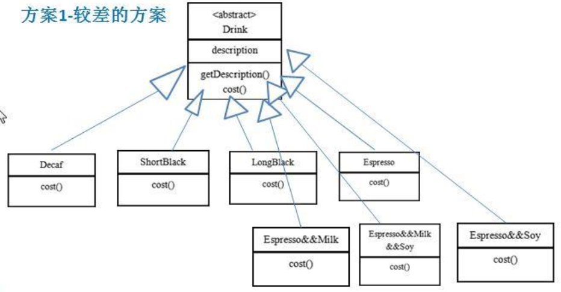
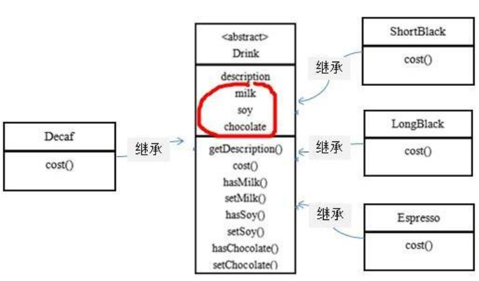
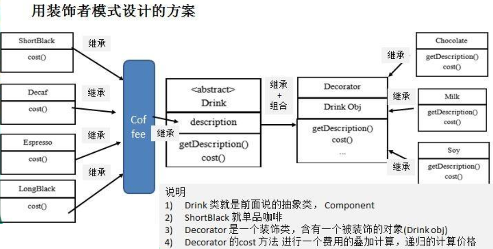
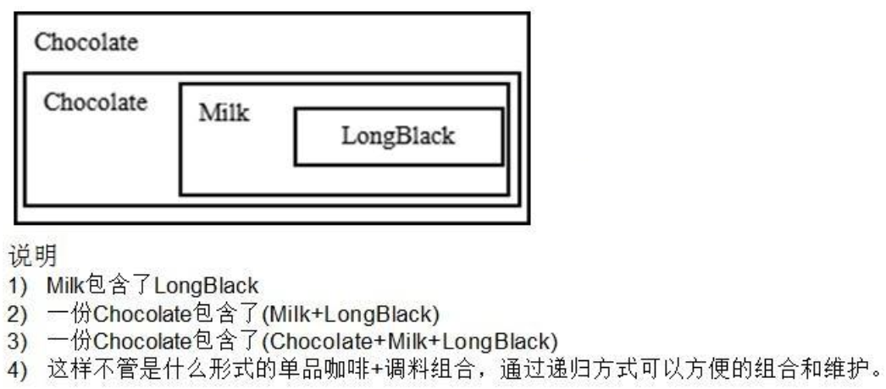

# Decorator Mode

> 星巴克咖啡订单项目（咖啡馆）

1. 咖啡种类/单品咖啡：Espresso(意大利浓咖啡)、 ShortBlack、 LongBlack(美式咖啡)、 Decaf(无因咖啡)
2. 调料：Milk、 Soy(豆浆)、 Chocolate
3. 要求在扩展新的咖啡种类时，具有良好的扩展性、改动方便、维护方便
4. 使用 OO 的来计算不同种类咖啡的费用: 客户可以点单品咖啡，也可以单品咖啡+调料组合

---

> 传统方案解决星巴克咖啡订单项目



传统方案分析：

1. Drink 是一个抽象类，表示饮料
2. des 就是对咖啡的描述, 比如咖啡的名字
3. cost() 方法就是计算费用， Drink 类中做成一个抽象方法
4. Decaf 就是单品咖啡， 继承 Drink, 并实现 cost
5. Espress && Milk 就是单品咖啡+调料， 这个组合很多
6. 问题：这样设计，会有很多类，当我们增加一个单品咖啡，或者一个新的调料，类的数量就会倍增，就会出现**类爆炸**

---

> 改进方案解决星巴克咖啡订单项目

前面分析到方案 1 因为咖啡单品+调料组合会造成类的倍增，因此可以做改进，将调料内置到 Drink 类，这样就不会造成类数量过多。从而提高项目的维护性(如图)



改进方案分析：

1. 方案 2 可以控制类的数量，不至于造成很多的类
2. 在增加或者删除调料种类时，代码的维护量很大
3. 考虑到用户可以添加多份调料时，可以将 hasMilk 返回一个对应 int
4. 考虑使用**装饰者**模式

---

> 装饰者模式解决星巴克咖啡订单项目

装饰者模式定义：

1. 装饰者模式：动态的将新功能附加到对象上。在对象功能扩展方面，它比继承更有弹性，装饰者模式也体现了开闭原则(ocp)
2. 这里提到的动态的将新功能附加到对象和 ocp 原则，在后面的应用实例上会以代码的形式体现

装饰者模式方案：



应用实例（2份巧克力+一份牛奶的LongBlack订单）：



代码实现如下：

```java
package pers.ditto.decorator;

/**
 * @author OrangeCH3
 * @create 2021-07-19 10:38
 */

@SuppressWarnings("all")
public abstract class Drink {

    public String des; // 描述
    private float price = 0.0f;

    public String getDes() {
        return des;
    }

    public void setDes(String des) {
        this.des = des;
    }

    public float getPrice() {
        return price;
    }

    public void setPrice(float price) {
        this.price = price;
    }

    //计算费用的抽象方法
    //子类来实现
    public abstract float cost();
}
```

```java
package pers.ditto.decorator;

/**
 * @author OrangeCH3
 * @create 2021-07-19 10:39
 */

@SuppressWarnings("all")
public class Coffee extends Drink{

    @Override
    public float cost() {
        return getPrice();
    }
}
```

```java
package pers.ditto.decorator;


/**
 * @author OrangeCH3
 * @create 2021-07-19 10:42
 */

@SuppressWarnings("all")
public class Espresso extends Coffee {

    public Espresso() {
        setDes(" 意大利咖啡 ");
        setPrice(6.0f);
    }
}
```

```java
package pers.ditto.decorator;

/**
 * @author OrangeCH3
 * @create 2021-07-19 10:43
 */

@SuppressWarnings("all")
public class DeCaf extends Coffee{

    public DeCaf() {
        setDes(" 无因咖啡 ");
        setPrice(1.0f);
    }
}
```

```java
package pers.ditto.decorator;

/**
 * @author OrangeCH3
 * @create 2021-07-19 10:41
 */

@SuppressWarnings("all")
public class ShortBlack extends Coffee{

    public ShortBlack() {
        setDes(" shortblack ");
        setPrice(4.0f);
    }
}
```

```java
package pers.ditto.decorator;

/**
 * @author OrangeCH3
 * @create 2021-07-19 10:42
 */

@SuppressWarnings("all")
public class LongBlack extends Coffee{

    public LongBlack() {
        setDes(" longblack ");
        setPrice(5.0f);
    }
}
```

```java
package pers.ditto.decorator;

/**
 * @author OrangeCH3
 * @create 2021-07-19 10:43
 */

@SuppressWarnings("all")
public class Decorator extends Drink{

    private Drink obj;

    public Decorator(Drink obj) { //组合
        this.obj = obj;
    }

    @Override
    public float cost() {
        return getPrice() + obj.cost();
    }

    @Override
    public String getDes() {
        // obj.getDes() 输出被装饰者的信息
        return des + " " + getPrice() + " && " + obj.getDes();
    }
}
```

```java
package pers.ditto.decorator;

/**
 * @author OrangeCH3
 * @create 2021-07-19 10:46
 */

@SuppressWarnings("all")
public class Soy extends Decorator{
     public Soy(Drink obj) {
        super(obj);
        setDes(" 豆浆 ");
        setPrice(1.5f);
    }
}
```

```java
package pers.ditto.decorator;

/**
 * @author OrangeCH3
 * @create 2021-07-19 10:46
 */

@SuppressWarnings("all")
public class Chocolate extends Decorator{
    public Chocolate(Drink obj) {
        super(obj);
        setDes(" 巧克力 ");
        setPrice(3.0f);
    }
}
```

```java
package pers.ditto.decorator;

/**
 * @author OrangeCH3
 * @create 2021-07-19 10:47
 */

@SuppressWarnings("all")
public class Milk extends Decorator{
    public Milk(Drink obj) {
        super(obj);
        setDes(" 牛奶 ");
        setPrice(2.0f);
    }
}
```

```java
package pers.ditto.decorator;

/**
 * @author OrangeCH3
 * @create 2021-07-19 10:48
 */

@SuppressWarnings("all")
public class CoffeeBar {

    public static void main(String[] args) {
        // 1. 点一份 LongBlack
        Drink order = new LongBlack();
        System.out.println("点一份 LongBlack：");
        System.out.println("费用=" + order.cost());
        System.out.println("描述=" + order.getDes());
        System.out.println();

        // 2. order 加入一份牛奶
        order = new Milk(order);

        System.out.println("Order 加入一份牛奶：");
        System.out.println("费用 =" + order.cost());
        System.out.println("描述 = " + order.getDes());
        System.out.println();

        // 3. order 加入一份巧克力

        order = new Chocolate(order);

        System.out.println("Order 再加入一份巧克力：");
        System.out.println("费用 =" + order.cost());
        System.out.println("描述 = " + order.getDes());
        System.out.println();

        // 3. order 加入一份巧克力

        order = new Chocolate(order);

        System.out.println("Order 再再加入一份巧克力：");
        System.out.println("费用 =" + order.cost());
        System.out.println("描述 = " + order.getDes());
        System.out.println();

        Drink order2 = new DeCaf();

        System.out.println("点一份无因咖啡：");
        System.out.println("费用 =" + order2.cost());
        System.out.println("描述 = " + order2.getDes());
        System.out.println();

        order2 = new Milk(order2);

        System.out.println("Order 加入一份牛奶：");
        System.out.println("费用 =" + order2.cost());
        System.out.println("描述 = " + order2.getDes());

    }
}
```

```java
/* 输出结果为：
        点一份 LongBlack：
        费用=5.0
        描述= longblack 

        Order 加入一份牛奶：
        费用 =7.0
        描述 =  牛奶  2.0 &&  longblack 

        Order 再加入一份巧克力：
        费用 =10.0
        描述 =  巧克力  3.0 &&  牛奶  2.0 &&  longblack 

        Order 再再加入一份巧克力：
        费用 =13.0
        描述 =  巧克力  3.0 &&  巧克力  3.0 &&  牛奶  2.0 &&  longblack 

        点一份无因咖啡：
        费用 =1.0
        描述 =  无因咖啡 

        Order 加入一份牛奶：
        费用 =3.0
        描述 =  牛奶  2.0 &&  无因咖啡 

        Process finished with exit code 0
*/
```
