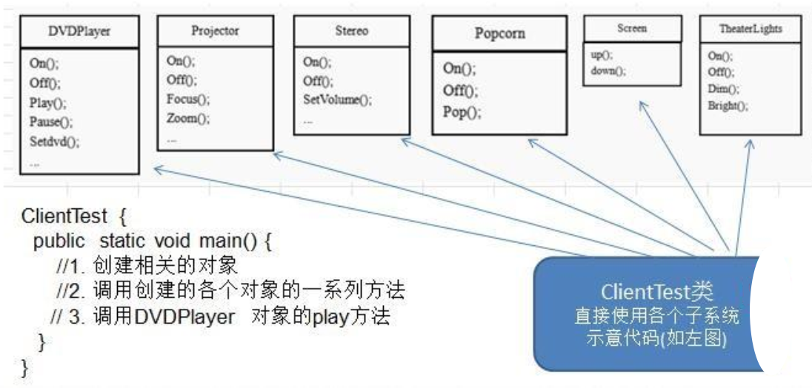
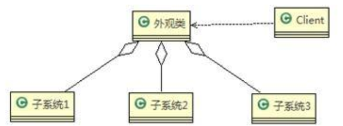
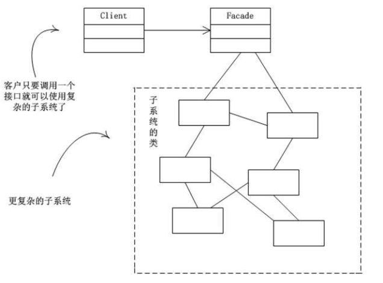

# Facade Mode

> 影院管理项目

组建一个家庭影院，要求直接用一个遥控器统筹各设备开关，其操作流程为：

1. 开爆米花机
2. 放下屏幕
3. 开投影仪
4. 开音响
5. 开DVD，选Movie
6. 去拿爆米花
7. 调暗灯光
8. 播放
9. 观影结束，关闭所有设备

---

> 传统方式解决影院管理



传统方式解决影院管理问题分析:

1. 在 ClientTest 的 main 方法中，创建各个子系统的对象，并直接去调用子系统(对象)相关方法，会造成调用过程混乱，没有清晰的过程
2. 不利于在 ClientTest 中，去维护对子系统的操作
3. 解决思路：定义一个高层接口，给子系统中的一组接口提供一个一致的界面(比如在高层接口提供四个方法 ready, play, pause, end )，用来访问子系统中的一群接口
4. 通过定义一个一致的接口(界面类)，用以屏蔽内部子系统的细节，使得调用端只需跟这个接口发生调用，而无需关心这个子系统的内部细节 → 外观模式

---

> 外观模式解决影院管理

基本介绍：

1. 外观模式（Facade），也叫过程模式：外观模式为子系统中的一组接口提供一个一致的界面，此模式定义了一个高层接口，这个接口使得这一子系统更加容易使用
2. 外观模式通过定义一个一致的接口，用以屏蔽内部子系统的细节，使得调用端只需跟这个接口发生调用，而无需关心这个子系统的内部细节

原理类图：



1. 外观类(Facade): 为调用端提供统一的调用接口, 外观类知道哪些子系统负责处理请求,从而将调用端的请求代理给适当子系统对象
2. 调用者(Client): 外观接口的调用者
3. 子系统的集合：指模块或者子系统，处理 Facade 对象指派的任务，他是功能的实际提供者

应用案例示意图说明：



代码实现：

```java
package pers.ditto.facade;

/**
 * @author OrangeCH3
 * @create 2021-07-20 16:52
 */

@SuppressWarnings("all")
public class TheaterLight {

    private static TheaterLight instance = new TheaterLight();

    public static TheaterLight getInstance() {
        return instance;
    }

    public void on() {
        System.out.println(" TheaterLight on ");
    }

    public void off() {
        System.out.println(" TheaterLight off ");
    }

    public void dim() {
        System.out.println(" TheaterLight dim ");
    }

    public void bright() {
        System.out.println(" TheaterLight bright ");
    }
}
```

```java
package pers.ditto.facade;

/**
 * @author OrangeCH3
 * @create 2021-07-20 16:54
 */

@SuppressWarnings("all")
public class Stereo {

    private static Stereo instance = new Stereo();

    public static Stereo getInstance() {
        return instance;
    }

    public void on() {
        System.out.println(" Stereo on ");
    }

    public void off() {
        System.out.println(" Stereo off ");
    }

    public void up() {
        System.out.println(" Stereo up.. ");
    }
}
```

```java
package pers.ditto.facade;

/**
 * @author OrangeCH3
 * @create 2021-07-20 16:55
 */

@SuppressWarnings("all")
public class Screen {

    private static Screen instance = new Screen();

    public static Screen getInstance() {
        return instance;
    }

    public void up() {
        System.out.println(" Screen up ");
    }

    public void down() {
        System.out.println(" Screen down ");
    }
}
```

```java
package pers.ditto.facade;

/**
 * @author OrangeCH3
 * @create 2021-07-20 16:55
 */

@SuppressWarnings("all")
public class Projector {

    private static Projector instance = new Projector();

    public static Projector getInstance() {
        return instance;
    }

    public void on() {
        System.out.println(" Projector on ");
    }

    public void off() {
        System.out.println(" Projector ff ");
    }

    public void focus() {
        System.out.println(" Projector is Projector  ");
    }
}
```

```java
package pers.ditto.facade;

/**
 * @author OrangeCH3
 * @create 2021-07-20 16:56
 */

@SuppressWarnings("all")
public class Popcorn {

    private static Popcorn instance = new Popcorn();

    public static Popcorn getInstance() {
        return instance;
    }

    public void on() {
        System.out.println(" popcorn on ");
    }

    public void off() {
        System.out.println(" popcorn ff ");
    }

    public void pop() {
        System.out.println(" popcorn is poping  ");
    }
}
```

```java
package pers.ditto.facade;

/**
 * @author OrangeCH3
 * @create 2021-07-20 16:56
 */

@SuppressWarnings("all")
public class DVDPlayer {

    //使用单例模式, 使用饿汉式
    private static DVDPlayer instance = new DVDPlayer();

    public static DVDPlayer getInstanc() {
        return instance;
    }

    public void on() {
        System.out.println(" dvd on ");
    }
    public void off() {
        System.out.println(" dvd off ");
    }

    public void play() {
        System.out.println(" dvd is playing ");
    }

    public void pause() {
        System.out.println(" dvd pause ");
    }
}
```

```java
package pers.ditto.facade;

/**
 * @author OrangeCH3
 * @create 2021-07-20 16:57
 */

@SuppressWarnings("all")
public class HomeTheaterFacade {

    //定义各个子系统对象
    private TheaterLight theaterLight;
    private Popcorn popcorn;
    private Stereo stereo;
    private Projector projector;
    private Screen screen;
    private DVDPlayer dVDPlayer;


    //构造器
    public HomeTheaterFacade() {
        super();
        this.theaterLight = TheaterLight.getInstance();
        this.popcorn = Popcorn.getInstance();
        this.stereo = Stereo.getInstance();
        this.projector = Projector.getInstance();
        this.screen = Screen.getInstance();
        this.dVDPlayer = DVDPlayer.getInstanc();
    }

    //操作分成4步
    public void ready() {
        popcorn.on();
        popcorn.pop();
        screen.down();
        projector.on();
        stereo.on();
        dVDPlayer.on();
        theaterLight.dim();
    }

    public void play() {
        dVDPlayer.play();
    }

    public void pause() {
        dVDPlayer.pause();
    }

    public void end() {
        popcorn.off();
        theaterLight.bright();
        screen.up();
        projector.off();
        stereo.off();
        dVDPlayer.off();
    }
}
```

```java
package pers.ditto.facade;

import org.junit.Test;

/**
 * @author OrangeCH3
 * @create 2021-07-20 16:57
 */

@SuppressWarnings("all")
public class ClientFacade {

    @Test
    public void testFacade() {

        HomeTheaterFacade homeTheaterFacade = new HomeTheaterFacade();
        homeTheaterFacade.ready();
        homeTheaterFacade.play();
        homeTheaterFacade.pause();
        homeTheaterFacade.end();
    }
}
```

外观模式的注意事项和细节：

1. 外观模式对外屏蔽了子系统的细节，因此外观模式降低了客户端对子系统使用的复杂性
2. 外观模式对客户端与子系统的耦合关系进行解耦，让子系统内部的模块更易维护和扩展
3. 通过合理的使用外观模式，可以帮我们更好的划分访问的层次
4. 当系统需要进行分层设计时，可以考虑使用 Facade 模式
5. 在维护一个遗留的大型系统时，可能这个系统已经变得非常难以维护和扩展，此时可以考虑为新系统开发一个 Facade 类，来提供遗留系统的比较清晰简单的接口，让新系统与 Facade 类交互，提高复用性
6. 不能过多的或者不合理的使用外观模式，使用外观模式好，还是直接调用模块好。要以让系统有层次，利于维护为目的
