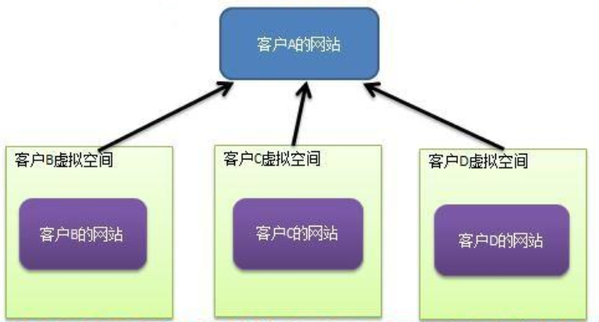

# Flyweight Mode

> 展示网站项目需求

小型的外包项目，给客户 A 做一个产品展示网站，客户 A 的朋友感觉效果不错，也希望做这样的产品展示网站，但是要求都有些不同：

1. 有客户要求以新闻的形式发布
2. 有客户人要求以博客的形式发布
3. 有客户希望以微信公众号的形式发布

---

> 传统方案解决网站展示项目

方案设计：

1. 创建客户 A 的网站
2. 直接复制粘贴一份，然后根据客户 B/C/D 不同要求，进行定制修改
2. 给每个网站租用一个空间

问题分析：

1. 

