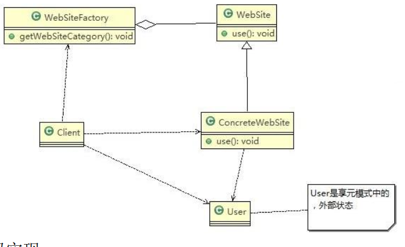

# Flyweight Mode

> 展示网站项目需求

小型的外包项目，给客户 A 做一个产品展示网站，客户 A 的朋友感觉效果不错，也希望做这样的产品展示网站，但是要求都有些不同：

1. 有客户要求以新闻的形式发布
2. 有客户人要求以博客的形式发布
3. 有客户希望以微信公众号的形式发布

---

> 传统方案解决网站展示项目

方案设计：

1. 创建客户 A 的网站
2. 直接复制粘贴一份，然后根据客户 B/C/D 不同要求，进行定制修改
2. 给每个网站租用一个空间


问题分析：

1. 需要的网站结构相似度很高，而且都不是高访问量网站，如果分成多个虚拟空间来处理，相当于一个相同网站的实例对象很多，造成服务器的资源浪费
2. 解决思路：整合到一个网站中，共享其相关的代码和数据，对于硬盘、内存、 CPU、数据库空间等服务器资源都可以达成共享，减少服务器资源
3. 对于代码来说，由于是一份实例，维护和扩展都更加容易
4. 上面的解决思路就可以使用**享元模式**来解决

---

> 享元模式解决网站展示项目

基本介绍：

1. 享元模式（Flyweight Mode） 也叫蝇量模式: 运用共享技术有效地支持大量细粒度的对象
2. 常用于系统底层开发，解决系统的性能问题。像数据库连接池，里面都是创建好的连接对象，在这些连接对象中有我们需要的则直接拿来用，避免重新创建，如果没有我们需要的，则创建一个
3. 享元模式能够解决重复对象的内存浪费的问题，当系统中有大量相似对象，需要缓冲池时。不需总是创建新对象，可以从缓冲池里拿。这样可以降低系统内存，同时提高效率
4. 享元模式经典的应用场景就是池技术了， String 常量池、数据库连接池、缓冲池等等都是享元模式的应用，享元模式是池技术的重要实现方式

原理类图：


1. FlyWeight 是抽象的享元角色, 他是产品的抽象类, 同时定义出对象的外部状态和内部状态(后面介绍) 的接口或实现
2. ConcreteFlyWeight 是具体的享元角色，是具体的产品类，实现抽象角色定义相关业务
3. UnSharedConcreteFlyWeight 是不可共享的角色，一般不会出现在享元工厂
4. FlyWeightFactory 享元工厂类，用于构建一个池容器(集合)， 同时提供从池中获取对象方法

内部状态和外部状态：

1. 享元模式提出了两个要求：细粒度和共享对象。这里就涉及到内部状态和外部状态了，即将对象的信息分为两个部分：内部状态和外部状态
2. 内部状态指对象共享出来的信息，存储在享元对象内部且不会随环境的改变而改变
3. 外部状态指对象得以依赖的一个标记，是随环境改变而改变的、不可共享的状态
4. 举个例子：围棋理论上有 361 个空位可以放棋子，每盘棋都有可能有两三百个棋子对象产生，因为内存空间有限，一台服务器很难支持更多的玩家玩围棋游戏，如果用享元模式来处理棋子，那么棋子对象就可以减少到只有两个实例，这样就很好的解决了对象的开销问题

具体项目分析示意图：



代码实现：

```java

```
