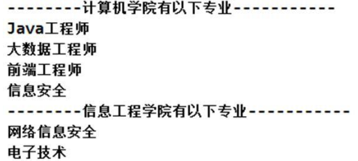
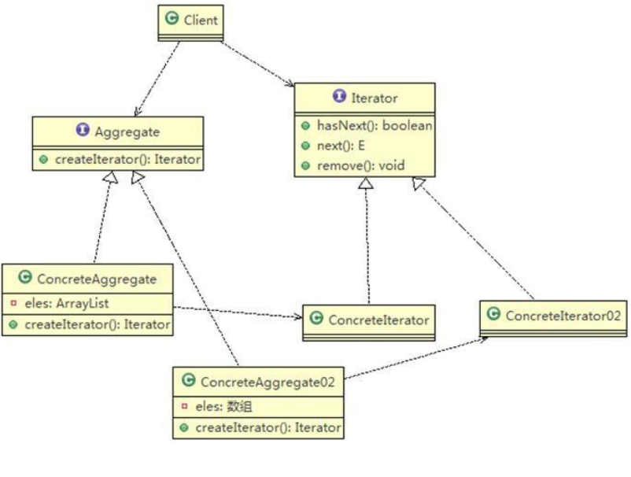

# Iterator Mode

> 学校院系展示项目需求

编写程序展示一个学校院系结构：需求是这样，要在一个页面中展示出学校的院系组成，一个学校有多个学院， 一个学院有多个系。如图：



---

> 传统方案解决学校院系展示项目


传统的方式的问题分析：

1. 将学院看做是学校的子类，系是学院的子类，这样实际上是站在组织大小来进行分层次的
2. 实际上我们的要求是 ：在一个页面中展示出学校的院系组成，一个学校有多个学院，一个学院有多个系， 因此这种方案，不能很好实现的遍历的操作
3. 解决方案：迭代器模式

---

> 迭代器模式解决学校院系展示项目

基本介绍：

1. 迭代器模式（Iterator Pattern）是常用的设计模式，属于行为型模式
2. 如果我们的集合元素是用不同的方式实现的，有数组，还有 java 的集合类，或者还有其他方式，当客户端要遍历这些集合元素的时候就要使用多种遍历方式，而且还会暴露元素的内部结构，可以考虑使用迭代器模式解决
3. 迭代器模式，提供一种遍历集合元素的统一接口，用一致的方法遍历集合元素，不需要知道集合对象的底层表示，即：不暴露其内部的结构

原理类图：



代码实现：

```java
package pers.ditto.iterator;

import lombok.AllArgsConstructor;
import lombok.Data;
import lombok.NoArgsConstructor;

/**
 * @author OrangeCH3
 * @create 2021-07-28 16:39
 */

@SuppressWarnings("all")
@AllArgsConstructor
@NoArgsConstructor
@Data
public class Department {

    private String name;
    private String desc;
}
```

```java
package pers.ditto.iterator;

import java.util.Iterator;

/**
 * @author OrangeCH3
 * @create 2021-07-28 16:40
 */

@SuppressWarnings("all")
public interface College {

    public String getName();

    //增加系的方法
    public void addDepartment(String name, String desc);

    //返回一个迭代器,遍历
    public Iterator createIterator();
}
```

```java
package pers.ditto.iterator;

import java.util.ArrayList;
import java.util.Iterator;
import java.util.List;

/**
 * @author OrangeCH3
 * @create 2021-07-28 16:41
 */

@SuppressWarnings("all")
public class InfoCollege implements College {

    List<Department> departmentList;


    public InfoCollege() {
        departmentList = new ArrayList<Department>();
        addDepartment("信息安全专业", " 信息安全专业 ");
        addDepartment("网络安全专业", " 网络安全专业 ");
        addDepartment("服务器安全专业", " 服务器安全专业 ");
    }

    @Override
    public String getName() {
        return "信息工程学院";
    }

    @Override
    public void addDepartment(String name, String desc) {
        Department department = new Department(name, desc);
        departmentList.add(department);
    }

    @Override
    public Iterator createIterator() {
        return new InfoColleageIterator(departmentList);
    }

}
```

```java
package pers.ditto.iterator;

import java.util.Iterator;
import java.util.List;

/**
 * @author OrangeCH3
 * @create 2021-07-28 16:43
 */

@SuppressWarnings("all")
public class InfoColleageIterator implements Iterator {


    List<Department> departmentList; // 信息工程学院是以List方式存放系
    int index = -1;//索引


    public InfoColleageIterator(List<Department> departmentList) {
        this.departmentList = departmentList;
    }

    //判断list中还有没有下一个元素
    @Override
    public boolean hasNext() {
        if(index >= departmentList.size() - 1) {
            return false;
        } else {
            index += 1;
            return true;
        }
    }

    @Override
    public Object next() {
        return departmentList.get(index);
    }

    //空实现remove
    public void remove() {

    }

}
```

```java
package pers.ditto.iterator;

import java.util.Iterator;

/**
 * @author OrangeCH3
 * @create 2021-07-28 16:44
 */

@SuppressWarnings("all")
public class ComputerCollege implements College {

    Department[] departments;
    int numOfDepartment = 0 ;// 保存当前数组的对象个数


    public ComputerCollege() {
        departments = new Department[5];
        addDepartment("Java专业", " Java专业 ");
        addDepartment("PHP专业", " PHP专业 ");
        addDepartment("大数据专业", " 大数据专业 ");

    }


    @Override
    public String getName() {
        return "计算机学院";
    }

    @Override
    public void addDepartment(String name, String desc) {
        Department department = new Department(name, desc);
        departments[numOfDepartment] = department;
        numOfDepartment += 1;
    }

    @Override
    public Iterator createIterator() {
        return new ComputerCollegeIterator(departments);
    }

}
```

```java
package pers.ditto.iterator;

import java.util.Iterator;

/**
 * @author OrangeCH3
 * @create 2021-07-28 16:45
 */

@SuppressWarnings("all")
public class ComputerCollegeIterator implements Iterator {

    //这里我们需要Department 是以怎样的方式存放=>数组
    Department[] departments;
    int position = 0; //遍历的位置


    public ComputerCollegeIterator(Department[] departments) {
        this.departments = departments;
    }

    //判断是否还有下一个元素
    @Override
    public boolean hasNext() {
        if(position >= departments.length || departments[position] == null) {
            return false;
        }else {

            return true;
        }
    }

    @Override
    public Object next() {
        Department department = departments[position];
        position += 1;
        return department;
    }

    //删除的方法，默认空实现
    public void remove() {

    }

}
```

```java
package pers.ditto.iterator;

import java.util.Iterator;
import java.util.List;

/**
 * @author OrangeCH3
 * @create 2021-07-28 16:45
 */

@SuppressWarnings("all")
public class OutPutImpl {

    //学院集合
    List<College> collegeList;

    public OutPutImpl(List<College> collegeList) {

        this.collegeList = collegeList;
    }
    //遍历所有学院,然后调用printDepartment 输出各个学院的系
    public void printCollege() {

        //从collegeList 取出所有学院, Java 中的 List 已经实现Iterator
        Iterator<College> iterator = collegeList.iterator();

        while(iterator.hasNext()) {
            //取出一个学院
            College college = iterator.next();
            System.out.println("=== "+college.getName() +"=====" );
            printDepartment(college.createIterator()); //得到对应迭代器
        }
    }


    //输出 学院输出 系

    public void printDepartment(Iterator iterator) {
        while(iterator.hasNext()) {
            Department d = (Department)iterator.next();
            System.out.println(d.getName());
        }
    }
}
```

```java
package pers.ditto.iterator;

import org.junit.Test;

import java.util.ArrayList;
import java.util.List;

/**
 * @author OrangeCH3
 * @create 2021-07-28 16:46
 */

@SuppressWarnings("all")
public class ClientIterator {

    @Test
    public void testIterator() {

        //创建学院
        List<College> collegeList = new ArrayList<College>();

        ComputerCollege computerCollege = new ComputerCollege();
        InfoCollege infoCollege = new InfoCollege();

        collegeList.add(computerCollege);
        collegeList.add(infoCollege);

        OutPutImpl outPutImpl = new OutPutImpl(collegeList);
        outPutImpl.printCollege();
    }
}
```

迭代器模式的注意事项和细节：

1. 优点
   1. 提供一个统一的方法遍历对象，客户不用再考虑聚合的类型，使用一种方法就可以遍历对象了
   2. 隐藏了聚合的内部结构，客户端要遍历聚合的时候只能取到迭代器，而不会知道聚合的具体组成
   3. 提供了一种设计思想，就是一个类应该只有一个引起变化的原因（叫做单一责任原则） 。在聚合类中，我们把迭代器分开，就是要把管理对象集合和遍历对象集合的责任分开，这样一来集合改变的话，只影响到聚合对象。而如果遍历方式改变的话，只影响到了迭代器
   4. 当要展示一组相似对象，或者遍历一组相同对象时使用, 适合使用迭代器模式
2. 缺点
   1. 每个聚合对象都要一个迭代器，会生成多个迭代器，不容易管理类


