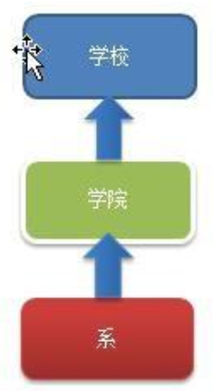

# Iterator Mode

> 学校院系展示项目需求

编写程序展示一个学校院系结构：需求是这样，要在一个页面中展示出学校的院系组成，一个学校有多个学院， 一个学院有多个系。如图：


---

> 传统方案解决学校院系展示项目



传统的方式的问题分析：

1. 将学院看做是学校的子类，系是学院的子类，这样实际上是站在组织大小来进行分层次的
2. 实际上我们的要求是 ：在一个页面中展示出学校的院系组成，一个学校有多个学院，一个学院有多个系， 因此这种方案，不能很好实现的遍历的操作
3. 解决方案：迭代器模式

---

> 迭代器模式解决学校院系展示项目

基本介绍：

1. 迭代器模式（Iterator Pattern）是常用的设计模式，属于行为型模式
2. 如果我们的集合元素是用不同的方式实现的，有数组，还有 java 的集合类，或者还有其他方式，当客户端要遍历这些集合元素的时候就要使用多种遍历方式，而且还会暴露元素的内部结构，可以考虑使用迭代器模式解决
3. 迭代器模式，提供一种遍历集合元素的统一接口，用一致的方法遍历集合元素，不需要知道集合对象的底层表示，即：不暴露其内部的结构

原理类图：


代码实现：

```java

```


