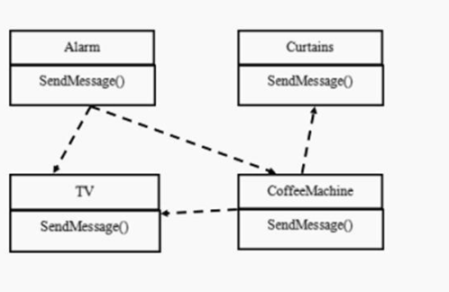

# Mediator Mode

> 智能家庭项目

1. 智能家庭包括各种设备，闹钟、咖啡机、电视机、窗帘 等
2. 主人要看电视时，各个设备可以协同工作，自动完成看电视的准备工作，比如流程为：闹铃响起 → 咖啡机开始做咖啡 → 窗帘自动落下 → 电视机开始播放

---

> 传统方法解决智能家庭管理问题

问题分析：

1. 当各电器对象有多种状态改变时，相互之间的调用关系会比较复杂
2. 各个电器对象彼此联系，你中有我，我中有你，不利于松耦合
3. 各个电器对象之间所传递的消息(参数)，容易混乱
4. 当系统增加一个新的电器对象时， 或者执行流程改变时， 代码的可维护性、扩展性都不理想 → 考虑中介者模式

---

> 中介者模式解决智能家庭管理问题

