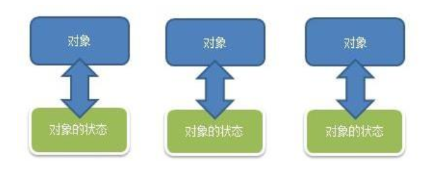
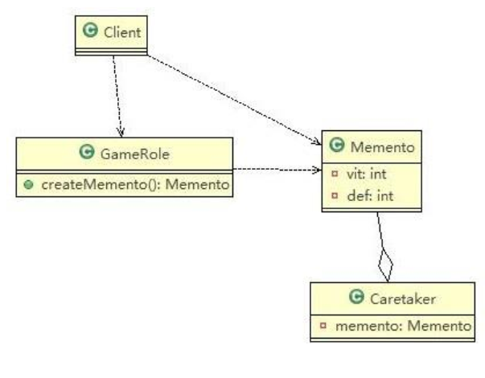

# Memento Mode

> 游戏角色状态恢复问题

游戏角色有攻击力和防御力，在大战 Boss 前保存自身的状态(攻击力和防御力)，当大战 Boss 后攻击力和防御力下降，从备忘录对象恢复到大战前的状态

---

> 传统方案解决游戏角色恢复



问题分析：

1. 一个对象，就对应一个保存对象状态的对象， 这样当我们游戏的对象很多时，不利于管理，开销也很大
2. 传统的方式是简单地做备份， new 出另外一个对象出来，再把需要备份的数据放到这个新对象，但这就暴露了对象内部的细节
3. 解决方案：备忘录模式

---

> 备忘录模式解决游戏角色恢复

基本介绍：

1. 备忘录模式（Memento Pattern） 在不破坏封装性的前提下，捕获一个对象的内部状态，并在该对象之外保存这个状态。这样以后就可将该对象恢复到原先保存的状态
2. 可以这里理解备忘录模式：现实生活中的备忘录是用来记录某些要去做的事情，或者是记录已经达成的共同意见的事情，以防忘记了。而在软件层面，备忘录模式有着相同的含义，备忘录对象主要用来记录一个对象的某种状态，或者某些数据，当要做回退时，可以从备忘录对象里获取原来的数据进行恢复操作
3. 备忘录模式属于行为型模式

原理类图：



代码实现：

```java
package pers.ditto.memento;

import lombok.AllArgsConstructor;
import lombok.Data;
import lombok.NoArgsConstructor;

/**
 * @author OrangeCH3
 * @create 2021-07-31 9:54
 */

@SuppressWarnings("all")
@AllArgsConstructor
@NoArgsConstructor
@Data
public class Memento {

    //攻击力
    private int vit;
    //防御力
    private int def;
}
```

```java
package pers.ditto.memento;

/**
 * @author OrangeCH3
 * @create 2021-07-31 9:56
 */

@SuppressWarnings("all")
public class GameRole {

    private int vit;
    private int def;

    //创建Memento ,即根据当前的状态得到Memento
    public Memento createMemento() {
        return new Memento(vit, def);
    }

    //从备忘录对象，恢复GameRole的状态
    public void recoverGameRoleFromMemento(Memento memento) {
        this.vit = memento.getVit();
        this.def = memento.getDef();
    }

    //显示当前游戏角色的状态
    public void display() {
        System.out.println("游戏角色当前的攻击力：" + this.vit + " 防御力: " + this.def);
    }

    public int getVit() {
        return vit;
    }

    public void setVit(int vit) {
        this.vit = vit;
    }

    public int getDef() {
        return def;
    }

    public void setDef(int def) {
        this.def = def;
    }
}
```

```java
package pers.ditto.memento;

/**
 * @author OrangeCH3
 * @create 2021-07-31 9:57
 */

@SuppressWarnings("all")
public class Caretaker {

    //如果只保存一次状态
    private Memento  memento;
    //对GameRole 保存多次状态
    //private ArrayList<Memento> mementos;
    //对多个游戏角色保存多个状态
    //private HashMap<String, ArrayList<Memento>> rolesMementos;

    public Memento getMemento() {
        return memento;
    }

    public void setMemento(Memento memento) {
        this.memento = memento;
    }
}
```

```java
package pers.ditto.memento;

import org.junit.Test;

/**
 * @author OrangeCH3
 * @create 2021-07-31 9:57
 */

@SuppressWarnings("all")
public class ClientMemento {

    @Test
    public void testMemento() {

        //创建游戏角色
        GameRole gameRole = new GameRole();
        gameRole.setVit(100);
        gameRole.setDef(100);

        System.out.println("和boss大战前的状态");
        gameRole.display();

        //把当前状态保存caretaker
        Caretaker caretaker = new Caretaker();
        caretaker.setMemento(gameRole.createMemento());

        System.out.println("和boss大战ing");
        gameRole.setDef(30);
        gameRole.setVit(30);

        gameRole.display();

        System.out.println("大战后，使用备忘录对象恢复到站前");

        gameRole.recoverGameRoleFromMemento(caretaker.getMemento());
        System.out.println("恢复后的状态");
        gameRole.display();
    }
}
```

备忘录模式的注意事项和细节：

1. 给用户提供了一种可以恢复状态的机制，可以使用户能够比较方便地回到某个历史的状态
2. 实现了信息的封装，使得用户不需要关心状态的保存细节
3. 如果类的成员变量过多，势必会占用比较大的资源，而且每一次保存都会消耗一定的内存, 这个需要注意
4. 适用的应用场景有
   1. 后悔药
   2. 打游戏时的存档
   3. Windows 里的 ctri + z
   4. IE 中的后退
   5. 数据库的事务管理
5. 为了节约内存，备忘录模式可以和原型模式配合使用
