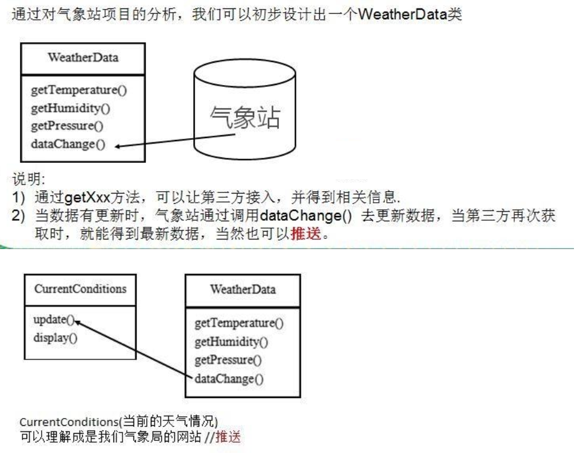
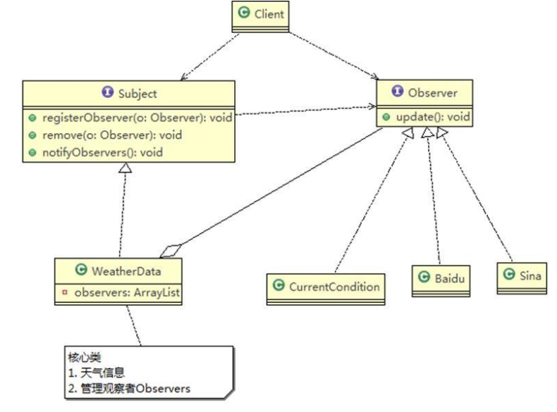

# Observer Mode

> 天气预报项目需求

1. 气象站可以将每天测量到的温度，湿度，气压等等以公告的形式发布出去(比如发布到自己的网站或第三方)
2. 需要设计开放型 API，便于其他第三方也能接入气象站获取数据
3. 提供温度、气压和湿度的接口
4. 测量数据更新时，要能实时的通知给第三方

---

> 传统方案解决天气预报项目

方案设计：



代码实现：

```java
package pers.ditto.traditional;

/**
 * @author OrangeCH3
 * @create 2021-07-29 10:00
 */

@SuppressWarnings("all")
public class CurrentConditions {

    // 温度，气压，湿度
    private float temperature;
    private float pressure;
    private float humidity;

    //更新 天气情况，是由 WeatherData 来调用，我使用推送模式
    public void update(float temperature, float pressure, float humidity) {
        this.temperature = temperature;
        this.pressure = pressure;
        this.humidity = humidity;
        display();
    }

    //显示
    public void display() {
        System.out.println("Today → Temperature: " + temperature);
        System.out.println("Today → Pressure: " + pressure);
        System.out.println("Today → Humidity: " + humidity);
    }
}
```

```java
package pers.ditto.traditional;

/**
 * @author OrangeCH3
 * @create 2021-07-29 10:01
 * 类是核心
 * 1. 包含最新的天气情况信息
 * 2. 含有 CurrentConditions 对象
 * 3. 当数据有更新时，就主动的调用 CurrentConditions对象update方法(含 display), 这样他们（接入方）就看到最新的信息
 */


@SuppressWarnings("all")
public class WeatherData {

    private float temperatrue;
    private float pressure;
    private float humidity;
    private CurrentConditions currentConditions;
    //加入新的第三方

    public WeatherData(CurrentConditions currentConditions) {
        this.currentConditions = currentConditions;
    }

    public float getTemperature() {
        return temperatrue;
    }

    public float getPressure() {
        return pressure;
    }

    public float getHumidity() {
        return humidity;
    }

    public void dataChange() {
        //调用 接入方的 update
        currentConditions.update(getTemperature(), getPressure(), getHumidity());
    }

    //当数据有更新时，就调用 setData
    public void setData(float temperature, float pressure, float humidity) {
        this.temperatrue = temperature;
        this.pressure = pressure;
        this.humidity = humidity;
        //调用dataChange， 将最新的信息 推送给 接入方 currentConditions
        dataChange();
    }
}
```

```java
package pers.ditto.traditional;

import org.junit.Test;

/**
 * @author OrangeCH3
 * @create 2021-07-29 10:03
 */

@SuppressWarnings("all")
public class ClientTtad {

    @Test
    public void testTtad() {

        //创建接入方 currentConditions
        CurrentConditions currentConditions = new CurrentConditions();
        //创建 WeatherData 并将 接入方 currentConditions 传递到 WeatherData中
        WeatherData weatherData = new WeatherData(currentConditions);

        //更新天气情况
        weatherData.setData(30, 150, 40);

        //天气情况变化
        System.out.println("定时接收网站信息变化中。。。");
        weatherData.setData(40, 160, 20);
    }
}
```

问题分析：

1. 其他第三方接入气象站获取数据的问题
2. 无法在运行时动态的添加第三方 (新浪网站)
3. 违反了 ocp 原则

---

> 观察者模式解决天气预报项目

基本介绍：

1. 观察者模式类似订牛奶业务
2. 奶站/气象局：Subject
   1. registerObserver 注册
   2. removeObserver 移除
   3. notifyObservers() 通知所有的注册的用户，根据不同需求，可以是更新数据，让用户来取，也可能是实施推送，看具体需求定
3. 用户/第三方网站：Observer
4. 观察者模式：对象之间多对一依赖的一种设计方案，被依赖的对象为 Subject，依赖的对象为 Observer，Subject 通知 Observer 变化,比如这里的奶站是 Subject，是 1 的一方。用户时 Observer，是多的一方

原理类图：



代码实现：

```java
package pers.ditto.observer;


/**
 * @author OrangeCH3
 * @create 2021-07-29 10:12
 */

@SuppressWarnings("all")
public interface Subject {

    public void registerObserver(Observer o);
    public void removeObserver(Observer o);
    public void notifyObservers();
}
```

```java
package pers.ditto.observer;

import java.util.ArrayList;

/**
 * @author OrangeCH3
 * @create 2021-07-29 10:15
 * 类是核心
 * 1. 包含最新的天气情况信息
 * 2. 含有 观察者集合，使用ArrayList管理
 * 3. 当数据有更新时，就主动的调用 ArrayList, 通知所有的（接入方）就看到最新的信息
 */

@SuppressWarnings("all")
public class WeatherData implements Subject{

    private float temperatrue;
    private float pressure;
    private float humidity;
    //观察者集合
    private ArrayList<Observer> observers;

    //加入新的第三方

    public WeatherData() {
        observers = new ArrayList<Observer>();
    }

    public float getTemperature() {
        return temperatrue;
    }

    public float getPressure() {
        return pressure;
    }

    public float getHumidity() {
        return humidity;
    }

    public void dataChange() {
        //调用 接入方的 update

        notifyObservers();
    }

    //当数据有更新时，就调用 setData
    public void setData(float temperature, float pressure, float humidity) {
        this.temperatrue = temperature;
        this.pressure = pressure;
        this.humidity = humidity;
        //调用dataChange， 将最新的信息 推送给 接入方 currentConditions
        dataChange();
    }

    //注册一个观察者
    @Override
    public void registerObserver(Observer o) {
        observers.add(o);
    }

    //移除一个观察者
    @Override
    public void removeObserver(Observer o) {
        if(observers.contains(o)) {
            observers.remove(o);
        }
    }

    //遍历所有的观察者，并通知
    @Override
    public void notifyObservers() {
        for(int i = 0; i < observers.size(); i++) {
            observers.get(i).update(this.temperatrue, this.pressure, this.humidity);
        }
    }
}
```

```java
package pers.ditto.observer;

/**
 * @author OrangeCH3
 * @create 2021-07-29 10:13
 */

@SuppressWarnings("all")
public interface Observer {

    public void update(float temperature, float pressure, float humidity);
}
```

```java
package pers.ditto.observer;

/**
 * @author OrangeCH3
 * @create 2021-07-29 10:16
 */

@SuppressWarnings("all")
public class CurrentConditions implements Observer{

    // 温度，气压，湿度
    private float temperature;
    private float pressure;
    private float humidity;

    // 更新 天气情况，是由 WeatherData 来调用，我使用推送模式
    public void update(float temperature, float pressure, float humidity) {
        this.temperature = temperature;
        this.pressure = pressure;
        this.humidity = humidity;
        display();
    }

    // 显示
    public void display() {
        System.out.println("Today → Temperature: " + temperature + "(Observer Mode)");
        System.out.println("Today → Pressure: " + pressure + "(Observer Mode)");
        System.out.println("Today → Humidity: " + humidity + "(Observer Mode)");
    }
}
```

```java
package pers.ditto.observer;

/**
 * @author OrangeCH3
 * @create 2021-07-29 10:18
 */

@SuppressWarnings("all")
public class BaiduSite implements Observer{

    // 温度，气压，湿度
    private float temperature;
    private float pressure;
    private float humidity;

    // 更新 天气情况，是由 WeatherData 来调用，我使用推送模式
    public void update(float temperature, float pressure, float humidity) {
        this.temperature = temperature;
        this.pressure = pressure;
        this.humidity = humidity;
        display();
    }

    // 显示
    public void display() {
        System.out.println();
        System.out.println("Extended API(BaiDu) → Temperature: " + temperature + "(Observer Mode)");
        System.out.println("Extended API(BaiDu) → Pressure: " + pressure + "(Observer Mode)");
        System.out.println("Extended API(BaiDu) → Humidity: " + humidity + "(Observer Mode)");
    }
}
```

```java
package pers.ditto.observer;

import org.junit.Test;

/**
 * @author OrangeCH3
 * @create 2021-07-29 10:21
 */

@SuppressWarnings("all")
public class ClientObserver {

    @Test
    public void testObserver() {

        //创建一个WeatherData
        WeatherData weatherData = new WeatherData();

        //创建观察者
        CurrentConditions currentConditions = new CurrentConditions();
        BaiduSite baiduSite = new BaiduSite();

        //注册到weatherData
        weatherData.registerObserver(currentConditions);
        weatherData.registerObserver(baiduSite);

        //测试
        System.out.println("定时给已注册的观察者推送天气信息");
        weatherData.setData(10f, 100f, 30.3f);


        weatherData.removeObserver(currentConditions);
        //测试
        System.out.println();
        System.out.println("定时给已注册的观察者推送天气信息");
        weatherData.setData(10f, 100f, 30.3f);
    }
}
```

```
运行结果如下：
定时给已注册的观察者推送天气信息
Today → Temperature: 10.0(Observer Mode)
Today → Pressure: 100.0(Observer Mode)
Today → Humidity: 30.3(Observer Mode)

Extended API(BaiDu) → Temperature: 10.0(Observer Mode)
Extended API(BaiDu) → Pressure: 100.0(Observer Mode)
Extended API(BaiDu) → Humidity: 30.3(Observer Mode)

定时给已注册的观察者推送天气信息

Extended API(BaiDu) → Temperature: 10.0(Observer Mode)
Extended API(BaiDu) → Pressure: 100.0(Observer Mode)
Extended API(BaiDu) → Humidity: 30.3(Observer Mode)

Process finished with exit code 0
```

总结说明：

1. 观察者模式设计后，会以集合的方式来管理用户(Observer)，包括注册，移除和通知
2. 这样，我们增加观察者(这里可以理解成一个新的公告板)，就不需要去修改核心类 WeatherData 不会修改代码，遵守了 ocp 原则
