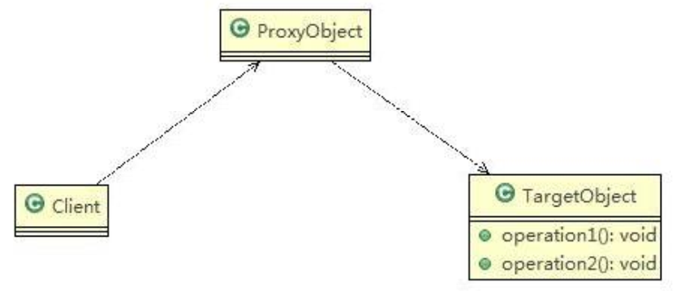
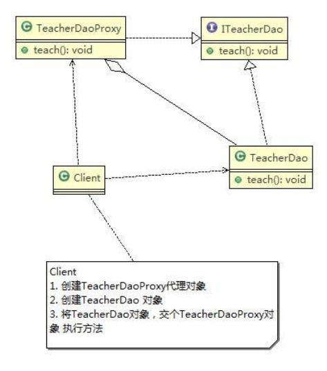

# Proxy Mode

> 代理模式(Proxy)

基本介绍：

1. 代理模式就是为一个对象提供一个替身，以控制对这个对象的访问。即通过代理对象访问目标对象.这样做的好处是可以在目标对象实现的基础上,增强额外的功能操作,即扩展目标对象的功能
2. 被代理的对象可以是远程对象、创建开销大的对象或需要安全控制的对象
3. 代理模式有不同的形式, 主要有三种 静态代理、动态代理 (JDK 代理、接口代理)和 Cglib 代理 (可以在内存动态的创建对象，而不需要实现接口，他是属于动态代理的范畴)
4. 代理模式示意图如下 

---

> 静态代理

基本介绍：

静态代理在使用时,需要定义接口或者父类,被代理对象(即目标对象)与代理对象一起实现相同的接口或者是继承相同父类

应用实例：

1. 定义一个接口:ITeacherDao
2. 目标对象 TeacherDAO 实现接口 ITeacherDAO
3. 使用静态代理方式,就需要在代理对象 TeacherDAOProxy 中也实现 ITeacherDAO
4. 调用的时候通过调用代理对象的方法来调用目标对象
5. 代理对象与目标对象要实现相同的接口,然后通过调用相同的方法来调用目标对象的方法

思路分析：



代码实现：

```java
package pers.ditto.staticproxy;

/**
 * @author OrangeCH3
 * @create 2021-07-22 14:49
 */

@SuppressWarnings("all")
public interface ITeacherDao {

    void teach(); // 授课的方法
}
```

```java
package pers.ditto.staticproxy;

/**
 * @author OrangeCH3
 * @create 2021-07-22 14:49
 */

@SuppressWarnings("all")
public class TeacherDao implements ITeacherDao{

    @Override
    public void teach() {
        System.out.println("老师正在授课中");
    }
}
```

```java
package pers.ditto.staticproxy;

/**
 * @author OrangeCH3
 * @create 2021-07-22 14:50
 */

//代理对象,静态代理
@SuppressWarnings("all")
public class TeacherDaoProxy implements ITeacherDao{

    private ITeacherDao target; // 目标对象，通过接口来聚合


    //构造器
    public TeacherDaoProxy(ITeacherDao target) {
        this.target = target;
    }

    @Override
    public void teach() {

        System.out.println("代课老师课前准备"); //方法
        target.teach();
        System.out.println("代课老师授课完成");
    }
}
```

```java
package pers.ditto.staticproxy;

import org.junit.Test;

/**
 * @author OrangeCH3
 * @create 2021-07-22 14:52
 */

@SuppressWarnings("all")
public class ClientStatic {

    @Test
    public void testStatic() {

        //创建目标对象(被代理对象)
        TeacherDao teacherDao = new TeacherDao();

        //创建代理对象, 同时将被代理对象传递给代理对象
        TeacherDaoProxy teacherDaoProxy = new TeacherDaoProxy(teacherDao);

        //通过代理对象，调用到被代理对象的方法
        //即：执行的是代理对象的方法，代理对象再去调用目标对象的方法
        teacherDaoProxy.teach();
    }
}
```

总结说明：

1. 优点：在不修改目标对象的功能前提下, 能通过代理对象对目标功能扩展
2. 缺点：因为代理对象需要与目标对象实现一样的接口,所以会有很多代理类
3. 一旦接口增加方法,目标对象与代理对象都要维护

---

> 动态代理


