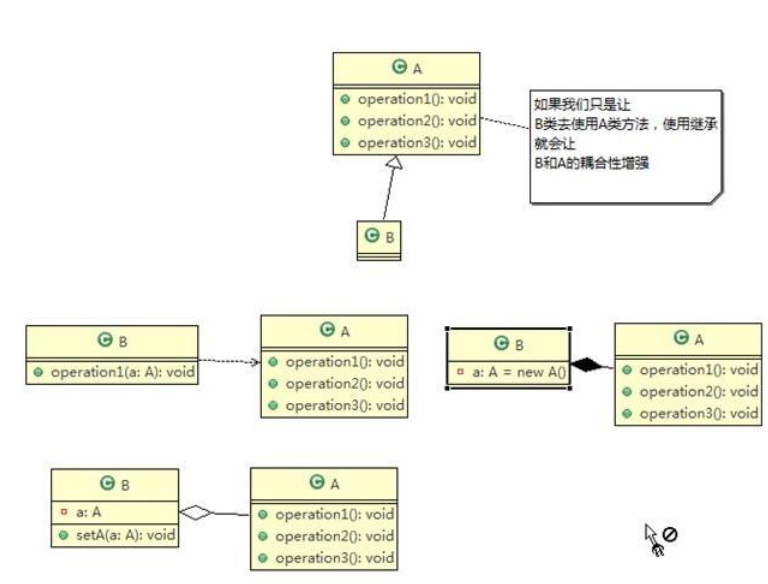

# Seven Principles

> 设计模式的目的

编写软件过程中，程序员面临着来自耦合性，内聚性以及可维护性，可扩展性，重用性，灵活性等多方面的挑战，设计模式是为了让程序(软件)，具有更好的性质

- 代码重用性 (即：相同功能的代码，不用多次编写)
- 可读性 (即：编程规范性, 便于其他程序员的阅读和理解)
- 可扩展性 (即：当需要增加新的功能时，非常的方便，称为可维护)
- 可靠性 (即：当我们增加新的功能后，对原来的功能没有影响)
- 使程序呈现高内聚，低耦合的特性

---

> 设计模式七大原则

1. 单一职责原则
2. 接口隔离原则
3. 依赖倒转(倒置)原则
4. 里氏替换原则
5. 开闭原则
6. 迪米特法则
7. 合成复用原则

---

> 单一职责原则

对类来说的，即一个类应该只负责一项职责。如类 A 负责两个不同职责：职责 1，职责 2。当职责 1 需求变更而改变 A 时，可能造成职责 2 执行错误，所以需要将类 A 的粒度分解为 A1， A2

以交通工具为例：
```java
package pers.ditto.principle.singleresponsibility;

/**
 * @author OrangeCH3
 * @create 2021-07-06 16:29
 */

@SuppressWarnings("all")
public class SingleResponsibility {

    public static void main(String[] args) {
        Vehicle vehicle = new Vehicle();
        vehicle.run("雷诺");
        vehicle.run("飞机");
        vehicle.run("轮船");

    }


}

// 交通工具类
// 方式1
// 1. 方式1的run方法中违反了单一职责原则
// 2. 解决方案非常简单，根据交通工具运行方法不同，分解成不同类即可
class Vehicle {
    public void run(String vehicle) {
        System.out.println(vehicle + "在公路驰骋!");
    }
}
```

```java
package pers.ditto.principle.singleresponsibility;

/**
 * @author OrangeCH3
 * @create 2021-07-06 16:38
 */

@SuppressWarnings("all")
public class SingleResponsibilityDitto {

    public static void main(String[] args) {
        RoadVehicle vehicle = new RoadVehicle();
        vehicle.run("雷诺");
        System.out.println();

        AirVehicle vehicle1 = new AirVehicle();
        vehicle1.run("飞机");
        System.out.println();

        WaterVehicle vehicle2 = new WaterVehicle();
        vehicle2.run("轮船");
    }

}


// 方式2
// 1. 遵守单一职责原则
// 2. 但是这样做改动比较大
// 3. 可以直接修改Vehicle类，改动的代码比较少
class RoadVehicle {
    public void run(String vehicle) {
        System.out.println(vehicle + "在公路驰骋!");
    }
}

class AirVehicle {
    public void run(String vehicle) {
        System.out.println(vehicle + "在天空翱翔!");
    }
}

class WaterVehicle {
    public void run(String vehicle) {
        System.out.println(vehicle + "在水中滑行!");
    }
}
```

```java
package pers.ditto.principle.singleresponsibility;

/**
 * @author OrangeCH3
 * @create 2021-07-06 16:44
 */

@SuppressWarnings("all")
public class SingleResponsibilityDittoo {

    public static void main(String[] args) {

        VehicleDitto vehicleDitto = new VehicleDitto();
        vehicleDitto.runRoad("雷诺");
        vehicleDitto.runAir("飞机");
        vehicleDitto.runWater("轮船");

    }

}

// 方式3
// 1. 这种修改方法没有对原来的类做大的修改，只是增加方法
// 2. 类上虽然没有执行单一职责，但是在方法上执行单一职责
class VehicleDitto {
    public void runRoad(String vehicle) {
        System.out.println(vehicle + "在公路驰骋!");
    }

    public void runWater(String vehicle) {
        System.out.println(vehicle + "在水中滑行!");
    }

    public void runAir(String vehicle) {
        System.out.println(vehicle + "在天空翱翔!");
    }
}
```

单一职责原则注意事项和细节:
- 降低类的复杂度，一个类只负责一项职责
- 提高类的可读性，可维护性
- 降低变更引起的风险
- 通常情况下，我们应当遵守单一职责原则，只有逻辑足够简单，才可以在代码级违反单一职责原则；只有类中方法数量足够少，可以在方法级别保持单一职责原则

---

> 接口隔离原则

客户端不应该依赖它不需要的接口，即一个类对另一个类的依赖应该建立在最小的接口上

案例(未使用接口隔离原则前)：类 A 通过接口 InterfaceA 依赖类 B，类 C 通过接口 InterfaceA 依赖类 D，如果接口 InterfaceA 对于类 A 和类 C 来说不是最小接口，那么类 B 和类 D 必须去实现他们不需要的方法

```java
package pers.ditto.principle.segregation;

/**
 * @author OrangeCH3
 * @create 2021-07-06 20:32
 */

@SuppressWarnings("all")
public class SegregationTest {

    public static void main(String[] args) {

        // A类对象只会依赖使用B实现类的operationOne/Two/Three方法，B实现类的operationFour/Five方法冗余
        ClassA classA = new ClassA();
        classA.dependOne(new ClassB());
        classA.dependTwo(new ClassB());
        classA.dependThree(new ClassB());
        System.out.println();

        // C类对象只会依赖使用D实现类的operationOne/Four/Five方法,D实现类的operationTwo/Three方法冗余
        ClassC classC = new ClassC();
        classC.dependOne(new ClassD());
        classC.dependFour(new ClassD());
        classC.dependFive(new ClassD());

    }
}


interface InterfaceA {
    void operationOne();
    void operationTwo();
    void operationThree();
    void operationFour();
    void operationFive();
}

class ClassB implements InterfaceA {

    @Override
    public void operationOne() {
        System.out.println("ClassB实现了operationOne");
    }

    @Override
    public void operationTwo() {
        System.out.println("ClassB实现了operationTwo");
    }

    @Override
    public void operationThree() {
        System.out.println("ClassB实现了operationThree");
    }

    @Override
    public void operationFour() {
        System.out.println("ClassB实现了operationFour");
    }

    @Override
    public void operationFive() {
        System.out.println("ClassB实现了operationFive");
    }
}


class ClassD implements InterfaceA {

    @Override
    public void operationOne() {
        System.out.println("ClassD实现了operationOne");
    }

    @Override
    public void operationTwo() {
        System.out.println("ClassD实现了operationTwo");
    }

    @Override
    public void operationThree() {
        System.out.println("ClassD实现了operationThree");
    }

    @Override
    public void operationFour() {
        System.out.println("ClassD实现了operationFour");
    }

    @Override
    public void operationFive() {
        System.out.println("ClassD实现了operationFive");
    }
}


// A类通过接口InterfaceA依赖使用B类，用到operationOne/Two/Three方法
class ClassA {
    public void dependOne(InterfaceA interfaceA) {
        interfaceA.operationOne();
    }

    public void dependTwo(InterfaceA interfaceA) {
        interfaceA.operationTwo();
    }

    public void dependThree(InterfaceA interfaceA) {
        interfaceA.operationThree();
    }
}


// C类通过接口InterfaceA依赖使用D类，用到operationOne/Four/Five方法
class ClassC {
    public void dependOne(InterfaceA interfaceA) {
        interfaceA.operationOne();
    }

    public void dependFour(InterfaceA interfaceA) {
        interfaceA.operationFour();
    }

    public void dependFive(InterfaceA interfaceA) {
        interfaceA.operationFive();
    }
}
```

案例(使用接口隔离原则后)：将接口 InterfaceA 拆分为独立的几个接口(这里我们拆分成 3 个接口)，类 A 和类 C 分别与他们需要的接口建立依赖关系。 也就是采用接口隔离原则

```java
package pers.ditto.principle.segregation;

/**
 * @author OrangeCH3
 * @create 2021-07-06 20:52
 */

@SuppressWarnings("all")
public class SegregationDitto {

    public static void main(String[] args) {

        // 使用接口隔离原则，实现类的功能函数没有冗余
        ClassADitto classADitto = new ClassADitto();
        classADitto.dependOne(new ClassBDitto());
        classADitto.dependTwo(new ClassBDitto());
        classADitto.dependThree(new ClassBDitto());
        System.out.println();

        ClassCDitto classCDitto = new ClassCDitto();
        classCDitto.dependOne(new ClassDDitto());
        classCDitto.dependFour(new ClassDDitto());
        classCDitto.dependFive(new ClassDDitto());

    }
}

// 接口隔离原则，使用三个接口进行功能函数隔离
interface InterfaceADitto {
    void operationOne();
}

interface InterfaceBDitto {
    void operationTwo();
    void operationThree();
}

interface InterfaceCDitto {
    void operationFour();
    void operationFive();
}

class ClassBDitto implements InterfaceADitto, InterfaceBDitto {

    @Override
    public void operationOne() {
        System.out.println("ClassB实现了operationOne");
    }

    @Override
    public void operationTwo() {
        System.out.println("ClassB实现了operationTwo");
    }

    @Override
    public void operationThree() {
        System.out.println("ClassB实现了operationThree");
    }
}

class ClassDDitto implements InterfaceADitto, InterfaceCDitto {

    @Override
    public void operationOne() {
        System.out.println("ClassD实现了operationOne");
    }

    @Override
    public void operationFour() {
        System.out.println("ClassD实现了operationFour");
    }

    @Override
    public void operationFive() {
        System.out.println("ClassD实现了operationFive");
    }
}

class ClassADitto {
    public void dependOne(InterfaceADitto interfaceADitto) {
        interfaceADitto.operationOne();
    }

    public void dependTwo(InterfaceBDitto interfaceBDitto) {
        interfaceBDitto.operationTwo();
    }

    public void dependThree(InterfaceBDitto interfaceBDitto) {
        interfaceBDitto.operationThree();
    }
}

class ClassCDitto {
    public void dependOne(InterfaceADitto interfaceADitto) {
        interfaceADitto.operationOne();
    }

    public void dependFour(InterfaceCDitto interfaceCDitto) {
        interfaceCDitto.operationFour();
    }

    public void dependFive(InterfaceCDitto interfaceCDitto) {
        interfaceCDitto.operationFive();
    }
}
```

---

> 依赖倒转原则

依赖倒转原则(Dependence Inversion Principle)是指：

1. 高层模块不应该依赖低层模块，二者都应该依赖其抽象
2. 抽象不应该依赖细节，细节应该依赖抽象
3. 依赖倒转(倒置)的中心思想是面向接口编程
4. 依赖倒转原则是基于这样的设计理念：相对于细节的多变性，抽象的东西要稳定的多。以抽象为基础搭建的架构比以细节为基础的架构要稳定的多。在 java 中，抽象指的是接口或抽象类，细节就是具体的实现类
5. 使用接口或抽象类的目的是制定好规范，而不涉及任何具体的操作，把展现细节的任务交给他们的实现类去完成

案例(未使用依赖倒转原则前):

```java
package pers.ditto.principle.inversion;

import org.junit.Test;

/**
 * @author OrangeCH3
 * @create 2021-07-07 18:30
 */

@SuppressWarnings("all")
public class DependenceInversion {

    public static void main(String[] args) {

        PersonTest personTest = new PersonTest();
        personTest.receive(new EmailTest());

    }

    // 也可以导入JUnit包插入@Test注解完成测试
    @Test
    public void testPerson() {
        PersonTest personTest = new PersonTest();
        personTest.receive(new EmailTest());
    }
}

// 完成要给Person接收消息的功能
// 方式1分析
// 1. 简单，比较容易实现
// 2. 如果获取的对象是微信、短信等，则需要新增类及类中方法
// 3. 解决思路：引入一个抽象的接口IReceiver，表示接收者，这样Person类与接口IReceiver发生依赖
// 4. Email、WeChat等实现接口即可，这样才符合依赖倒转原则
class PersonTest {
    public void receive(EmailTest emailTest) {
        System.out.println(emailTest.getInfo());
    }
}

class EmailTest {
    public String getInfo() {
        return "电子邮件信息：Hello, OrangeCH3!";
    }
}
```

案例(使用依赖倒转原则后):

```java
package pers.ditto.principle.inversion;

import org.junit.Test;

/**
 * @author OrangeCH3
 * @create 2021-07-07 18:43
 */

@SuppressWarnings("all")
public class DependenceInversionDitto {

    @Test
    public void test() {

        // 客户端无需改变
        PersonDitto personDitto = new PersonDitto();
        personDitto.receive(new EmailDitto());
        System.out.println();

        personDitto.receive(new WeChatDitto());
    }
}

// 定义一个接口
interface IReceiver {
    String getInfo();
}

class EmailDitto implements IReceiver {

    @Override
    public String getInfo() {
        return "电子邮件信息：HelloDitto, OrangeCH3!";
    }
}

// 增加WeChat
class WeChatDitto implements IReceiver {

    @Override
    public String getInfo() {
        return "微信收到消息：HelloDitto, OrangeCH3!";
    }
}

class PersonDitto {

    // 这里是对接口的依赖
    public void receive(IReceiver iReceiver) {
        System.out.println(iReceiver.getInfo());
    }
}
```

依赖倒转原则的注意事项和细节:
1. 低层模块尽量都要有抽象类或接口，或者两者都有，程序稳定性更好
2. 变量的声明类型尽量是抽象类或接口, 这样我们的变量引用和实际对象间，就存在一个缓冲层，利于程序扩展和优化
3. 继承时遵循里氏替换原则

---

> 里氏替换原则

里氏替换原则(Liskov Substitution Principle)在 1988 年，由麻省理工学院的以为姓里的女士提出的

1. 如果对每个类型为 T1 的对象 o1，都有类型为 T2 的对象 o2，使得以 T1 定义的所有程序 P 在所有的对象 o1 都代换成 o2 时，程序 P 的行为没有发生变化，那么类型 T2 是类型 T1 的子类型。换句话说，所有引用基类的地方必须能透明地使用其子类的对象
2. 在使用继承时，遵循里氏替换原则，在子类中尽量不要重写父类的方法
3. 里氏替换原则告诉我们，继承实际上让两个类耦合性增强了，在适当的情况下，可以通过聚合，组合，依赖 来解决问题

案例(未使用里氏替换原则前):

```java
package pers.ditto.principle.liskov;

import org.junit.Test;

/**
 * @author OrangeCH3
 * @create 2021-07-08 10:29
 */

@SuppressWarnings("all")
public class Liskov {

    @Test
    public void test() {
        LiskovA liskovA = new LiskovA();
        System.out.println("11 - 3 = " + liskovA.func(11, 3));
        System.out.println();

        LiskovB liskovB = new LiskovB();
        // 本意是求11-3，但由于重写父类方法，造成错误
        System.out.println("11 - 3 = " + liskovB.func(11, 3));
        System.out.println("11 - 3 + 9 = " + liskovB.funcImprove(11, 3));
        System.out.println();
        // 重写方法后实际的结果为下
        System.out.println("11 + 3 = " + liskovB.func(11, 3));
        System.out.println("11 + 3 + 9 = " + liskovB.funcImprove(11, 3));
    }
}

class LiskovA {
    public int func(int num1, int num2) {
        return num1 - num2;
    }
}

// 本意为B类新增一个加法函数，而在编程中无意将A类的func函数重写
class LiskovB extends LiskovA {
    public int func(int a, int b) {
        return a + b;
    }

    public int funcImprove(int a, int b) {
        return func(a, b) + 9;
    }
}
```

案例(使用里氏替换原则后):

```java
package pers.ditto.principle.liskov;

import org.junit.Test;

/**
 * @author OrangeCH3
 * @create 2021-07-08 10:41
 */

@SuppressWarnings("all")
public class LiskovDitto {

    @Test
    public void test() {

        LiskovADitto liskovADitto = new LiskovADitto();
        System.out.println("13 - 9 = " + liskovADitto.func(13, 9));
        System.out.println();

        // 应用里氏替换原则后，调用的方法就会很明确
        LiskovBDitto liskovBDitto = new LiskovBDitto();
        System.out.println("1 + 3 = " + liskovBDitto.func(1, 3));
        System.out.println("1 + 3 + 9 = " + liskovBDitto.funcImprove(1, 3));

    }
}

// 首先创建一个更加基础的类
class LiskovBase {

}

class LiskovADitto {
    public int func(int num1, int num2) {
        return num1 - num2;
    }
}

// 应用里氏替换原则降低类之间的耦合度
class LiskovBDitto extends LiskovBase {
    public int func(int a, int b) {
        return a + b;
    }

    public int funcImprove(int a, int b) {
        return func(a, b) + 9;
    }
}
```

---

> 开闭原则

开闭原则（Open Closed Principle）是编程中最基础、最重要的设计原则

1. 一个软件实体如类，模块和函数应该对扩展开放(对提供方)，对修改关闭(对使用方)。用抽象构建框架，用实现扩展细节
2. 当软件需要变化时，尽量通过扩展软件实体的行为来实现变化，而不是通过修改已有的代码来实现变化
3. 编程中遵循其它原则，以及使用设计模式的目的就是遵循开闭原则

案例(未使用开闭原则前):

```java
package pers.ditto.principle.ocp;

import org.junit.Test;

/**
 * @author OrangeCH3
 * @create 2021-07-09 11:25
 */

@SuppressWarnings("all")
public class Ocp {

    @Test
    public void test() {

        // 方式1
        // 1. 方式1优点是比较好理解，简单易操作
        // 2. 缺点是违反了设计模式的 ocp 原则，即对扩展开放(提供方)，对修改关闭(使用方)。即当我们给类增加新功能的时候，尽量不修改代码，或者尽可能少修改代码
        // 3. 比如我们这时要新增加一个图形种类 三角形，我们需要做如下修改，修改的地方较多
        // 改进思路：把创建 Shape 类做成抽象类， 并提供一个抽象的 draw 方法，让子类去实现即可，这样我们有新的图形种类时，只需要让新的图形类继承 Shape，并实现 draw 方法即可，使用方的代码就不需要修改
        GraphicEditor graphicEditor = new GraphicEditor();
        graphicEditor.drawShape(new Rectangle());
        graphicEditor.drawShape(new Circle());
        graphicEditor.drawShape(new Triangle());
    }
}

// 这是一个用于绘图的类[使用方]
class GraphicEditor {
    //接收 Shape 对象，然后根据 type，来绘制不同的图形
    public void drawShape(Shape s) {
        if (s.m_type == 1)
            drawRectangle(s);
        else if (s.m_type == 2)
            drawCircle(s);
        else if (s.m_type == 3)
            drawTriangle(s);
    }

    //绘制矩形
    public void drawRectangle(Shape r)
    { System.out.println(" 绘制矩形 ");
    }

    //绘制圆形
    public void drawCircle(Shape r) {
        System.out.println(" 绘制圆形 ");
    }

    //绘制三角形
    public void drawTriangle(Shape r)
    { System.out.println(" 绘制三角形 ");
    }
}

//Shape 类，基类
class Shape {
    int m_type;
}

class Rectangle extends Shape {
    Rectangle() {
    super.m_type = 1;
    }
}

class Circle extends Shape {
    Circle() {
    super.m_type = 2;
    }
}

//新增画三角形
class Triangle extends Shape {
    Triangle() {
    super.m_type = 3;
    }
}
```

案例(使用开闭原则后):

```java
package pers.ditto.principle.ocp;

import org.junit.Test;

/**
 * @author OrangeCH3
 * @create 2021-07-09 11:32
 */

@SuppressWarnings("all")
public class OcpDitto {

    @Test
    public void test() {

        // 改进后的代码符合开闭原则
        GraphicEditorDitto graphicEditorDitto = new GraphicEditorDitto();
        graphicEditorDitto.drawShape(new RectangleDitto());
        graphicEditorDitto.drawShape(new CircleDitto());
        graphicEditorDitto.drawShape(new TriangleDitto());
        graphicEditorDitto.drawShape(new OtherGraphicDitto());
    }
}

//这是一个用于绘图的类 [使用方]
class GraphicEditorDitto {
    //接收 Shape 对象，调用 draw 方法
    public void drawShape(ShapeDitto s) {
        s.draw();
    }
}

//Shape 类，基类
abstract class ShapeDitto {
    int m_type;
    public abstract void draw();//抽象方法
}

class RectangleDitto extends ShapeDitto {

    RectangleDitto() {
        super.m_type = 1;
    }

    @Override
    public void draw() {
        System.out.println(" 绘制矩形-OCP ");
    }
}

class CircleDitto extends ShapeDitto {

    CircleDitto() {
    super.m_type = 2;
    }

    @Override
    public void draw() {

        System.out.println(" 绘制圆形-OCP ");
    }
}

//新增画三角形
class TriangleDitto extends ShapeDitto {

    TriangleDitto() {
    super.m_type = 3;
}
    @Override
    public void draw() {

        System.out.println(" 绘制三角形-OCP ");
    }
}

//新增一个图形
class OtherGraphicDitto extends ShapeDitto {
    OtherGraphicDitto() {
    super.m_type = 4;
}
    @Override
    public void draw() {

        System.out.println(" 绘制其它图形-OCP ");
    }
}
```

---

> 迪米特法则

迪米特法则(Demeter Principle)又叫最少知道原则，即一个类对自己依赖的类知道的越少越好

1. 一个对象应该对其他对象保持最少的了解
2. 类与类关系越密切，耦合度越大
3. 对于被依赖的类不管多么复杂，都尽量将逻辑封装在类的内部。对外除了提供的public方法，不对外泄露任何信息
4. 只与直接的朋友通信，耦合的方式很多，依赖，关联，组合，聚合等。其中，我们称出现成员变量，方法参数，方法返回值中的类为直接的朋友，而出现在局部变量中的类不是直接的朋友。也就是说，陌生的类最好不要以局部变量的形式出现在类的内部。

案例(未使用迪米特原则前):

```java
package pers.ditto.principle.demeter;

import org.junit.Test;

import java.util.ArrayList;
import java.util.List;

/**
 * @author OrangeCH3
 * @create 2021-07-09 12:08
 */

@SuppressWarnings("all")
// 客户端
public class Demeter {

    @Test
    public void test() {

        // 创建了一个 SchoolManager 对象
        SchoolManager schoolManager = new SchoolManager();
        // 输出学院的员工 id 和 学校总部的员工信息
        schoolManager.printAllEmployee(new CollegeManager());
    }
}

// 学校总部员工类
class Employee {

    private String id;

    public void setId(String id) {
        this.id = id;
    }

    public String getId() {
        return id;
    }
}

// 学院的员工类
class CollegeEmployee {
    private String id;

    public void setId(String id) {
        this.id = id;
    }

    public String getId() {
        return id;
    }
}

// 管理学院员工的管理类
class CollegeManager {
    // 返回学院的所有员工
    public List<CollegeEmployee> getAllEmployee() {
        List<CollegeEmployee> list = new ArrayList<CollegeEmployee>();
        for (int i = 0; i < 10; i++) {
            // 这里我们增加了 10 个员工到 list
            CollegeEmployee emp = new CollegeEmployee();
            emp.setId("学院员工 id= " + i);
            list.add(emp);
        }
        return list;
    }
}

// 学校管理类
// 分析 SchoolManager 类的直接朋友类有哪些 Employee、 CollegeManager
// CollegeEmployee 不是直接朋友而是一个陌生类，这样违背了 迪米特法则
class SchoolManager {
    // 返回学校总部的员工
    public List<Employee> getAllEmployee()
    { List<Employee> list = new ArrayList<Employee>();
        for (int i = 0; i < 5; i++) { //这里我们增加了 5 个员工到 list
            Employee emp = new Employee();
            emp.setId("学校总部员工 id= " + i);
            list.add(emp);
        }
        return list;
    }

    // 该方法完成输出学校总部和学院员工信息(id)
    void printAllEmployee(CollegeManager sub) {
        // 分析问题
        // 1. 这 里 的 CollegeEmployee 不是 SchoolManager 的直接朋友
        // 2. CollegeEmployee 是以局部变量方式出现在 SchoolManager
        // 3. 违反了 迪米特法则
        // 获取到学院员工
        List<CollegeEmployee> list1 = sub.getAllEmployee();
        System.out.println("学院员工ID信息如下：");
        for (CollegeEmployee e : list1) {
            System.out.println(e.getId());
        }
        // 获取到学校总部员工
        List<Employee> list2 = this.getAllEmployee();
        System.out.println("学校总部员工ID信息如下：");
        for (Employee e : list2) {
            System.out.println(e.getId());
        }
    }
}
```

案例(使用迪米特原则后):

```java
package pers.ditto.principle.demeter;

import org.junit.Test;

import java.util.ArrayList;
import java.util.List;

/**
 * @author OrangeCH3
 * @create 2021-07-09 12:15
 */

@SuppressWarnings("all")
public class DemeterDitto {

    @Test
    public void test() {

        System.out.println("使用迪米特法则后->Ditto");
        // 创建了一个 SchoolManager 对象
        SchoolManagerDitto schoolManagerDitto = new SchoolManagerDitto();
        // 输出学院的员工 id 和 学校总部的员工信息
        schoolManagerDitto.printAllEmployee(new CollegeManagerDitto());
    }
}

// 学校总部员工类
class EmployeeDitto {
    private String id;

    public void setId(String id)
    { this.id = id;
    }
    public String getId()
    { return id;
    }
}

// 学院的员工类
class CollegeEmployeeDitto {
    private String id;

    public void setId(String id)
    { this.id = id;
    }

    public String getId()
    { return id;
    }
}

// 管理学院员工的管理类
class CollegeManagerDitto {
    // 返回学院的所有员工
    public List<CollegeEmployeeDitto> getAllEmployee() {
        List<CollegeEmployeeDitto> list = new ArrayList<CollegeEmployeeDitto>();
        for (int i = 0; i < 10; i++) { //这里我们增加了 10 个员工到 list
            CollegeEmployeeDitto emp = new CollegeEmployeeDitto();
            emp.setId("学院员工 id= " + i);
            list.add(emp);
        }
        return list;
    }

    // 输出学院员工的信息
    public void printEmployee() {
        // 获取到学院员工
        List<CollegeEmployeeDitto> list1 = getAllEmployee();
        System.out.println("学院员工学院员工ID信息如下：");
        for (CollegeEmployeeDitto e : list1) {
            System.out.println(e.getId());
        }
    }
}

// 学校管理类
// 分析 SchoolManager 类的直接朋友类有哪些 Employee、 CollegeManager
// CollegeEmployee 不是 直接朋友 而是一个陌生类，这样违背了 迪米特法则
class SchoolManagerDitto {
    //返回学校总部的员工
    public List<EmployeeDitto> getAllEmployee() {
        List<EmployeeDitto> list = new ArrayList<EmployeeDitto>();
        for (int i = 0; i < 5; i++) { //这里我们增加了 5 个员工到 list
            EmployeeDitto emp = new EmployeeDitto();
            emp.setId("学校总部员工 id= " + i);
            list.add(emp);
        }
        return list;
    }

    // 该方法完成输出学校总部和学院员工信息(id)
    void printAllEmployee(CollegeManagerDitto sub) {
        // 分析问题
        // 1. 将输出学院的员工方法，封装到 CollegeManager
        sub.printEmployee();
        // 获取到学校总部员工
        List<EmployeeDitto> list2 = this.getAllEmployee();
        System.out.println("学校总部员工ID信息如下：");
        for (EmployeeDitto e : list2) {
            System.out.println(e.getId());
        }
    }
}
```

迪米特法则注意事项和细节:

1. 迪米特法则的核心是降低类之间的耦合
2. 由于每个类都减少了不必要的依赖，因此迪米特法则只是要求降低类间(对象间)耦合关系，并不是要求完全没有依赖关系

---

> 合成复用原则

原则是尽量使用合成/聚合的方式，而不是使用继承



---

> 设计原则核心思想

1. 找出应用中可能需要变化之处，把它们独立出来，不要和那些不需要变化的代码混在一起
2. 针对接口编程，而不是针对实现编程
3. 为了交互对象之间的松耦合设计而努力