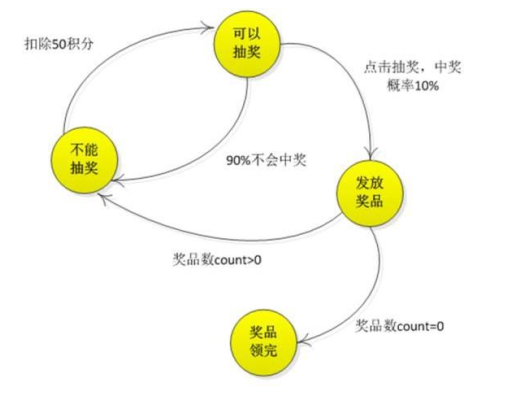
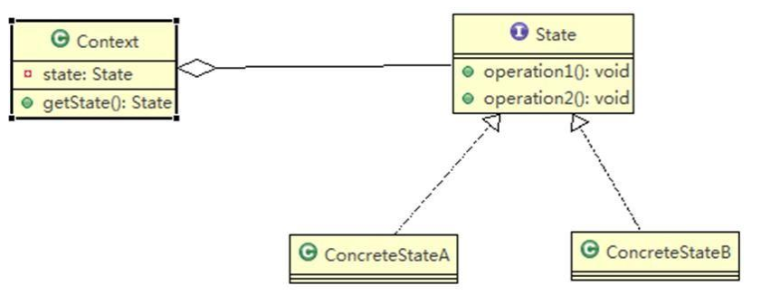
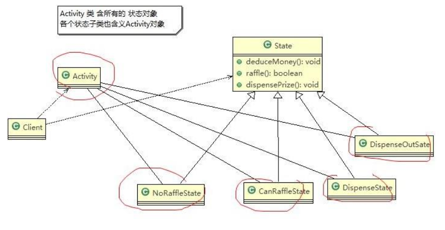

# State Mode

> APP 抽奖活动问题

请编写程序完成 APP 抽奖活动 具体要求如下:

1. 假如每参加一次这个活动要扣除用户 50 积分，中奖概率是 10%
2. 奖品数量固定，抽完就不能抽奖
3. 活动有四个状态: 可以抽奖、不能抽奖、发放奖品和奖品领完
4. 活动的四个状态转换关系图如下


---

> 状态模式解决抽奖活动问题

基本介绍：

1. 状态模式（State Pattern）：它主要用来解决对象在多种状态转换时，需要对外输出不同的行为的问题。状态和行为是一一对应的，状态之间可以相互转换
2. 当一个对象的内在状态改变时，允许改变其行为，这个对象看起来像是改变了其类

原理类图：



类图说明：

1. Context 类为环境角色, 用于维护 State 实例,这个实例定义当前状态
2. State 是抽象状态角色,定义一个接口封装与 Context 的一个特点接口相关行为
3. ConcreteState 具体的状态角色，每个子类实现一个与 Context 的一个状态相关行为

思路分析：

1. 定义出一个接口叫状态接口，每个状态都实现它
2. 接口有扣除积分方法、抽奖方法、发放奖品方法



代码实现：

```java
package pers.ditto.state;

/**
 * @author OrangeCH3
 * @create 2021-08-01 10:10
 */

@SuppressWarnings("all")
public abstract class State {

    // 扣除积分: -50
    public abstract void deductMoney();

    // 是否抽中奖品
    public abstract boolean raffle();

    // 发放奖品
    public abstract  void dispensePrize();
}
```

```java
package pers.ditto.state;

/**
 * @author OrangeCH3
 * @create 2021-08-01 10:12
 */

@SuppressWarnings("all")
public class NoRaffleState extends State{

    // 初始化时传入活动引用，扣除积分后改变其状态
    RaffleActivity activity;

    public NoRaffleState(RaffleActivity activity) {
        this.activity = activity;
    }

    // 当前状态可以扣积分 , 扣除后，将状态设置成可以抽奖状态
    @Override
    public void deductMoney() {
        System.out.println("扣除50积分成功，您可以抽奖了");
        activity.setState(activity.getCanRaffleState());
    }

    // 当前状态不能抽奖
    @Override
    public boolean raffle() {
        System.out.println("扣了积分才能抽奖喔！");
        return false;
    }

    // 当前状态不能发奖品
    @Override
    public void dispensePrize() {
        System.out.println("不能发放奖品");
    }
}
```

```java
package pers.ditto.state;

import java.util.Random;

/**
 * @author OrangeCH3
 * @create 2021-08-01 10:13
 */

@SuppressWarnings("all")
public class CanRaffleState extends State{

    RaffleActivity activity;

    public CanRaffleState(RaffleActivity activity) {
        this.activity = activity;
    }

    //已经扣除了积分，不能再扣
    @Override
    public void deductMoney() {
        System.out.println("已经扣取过了积分");
    }

    //可以抽奖, 抽完奖后，根据实际情况，改成新的状态
    @Override
    public boolean raffle() {
        System.out.println("正在抽奖，请稍等！");
        Random r = new Random();
        int num = r.nextInt(10);
        // 10%中奖机会
        if(num == 0){
            // 改变活动状态为发放奖品 context
            activity.setState(activity.getDispenseState());
            return true;
        }else{
            System.out.println("很遗憾没有抽中奖品！");
            // 改变状态为不能抽奖
            activity.setState(activity.getNoRafflleState());
            return false;
        }
    }

    // 不能发放奖品
    @Override
    public void dispensePrize() {
        System.out.println("没中奖，不能发放奖品");
    }
}
```

```java
package pers.ditto.state;

/**
 * @author OrangeCH3
 * @create 2021-08-01 10:14
 */

@SuppressWarnings("all")
public class DispenseState extends State{

    // 初始化时传入活动引用，发放奖品后改变其状态
    RaffleActivity activity;

    public DispenseState(RaffleActivity activity) {
        this.activity = activity;
    }

    //

    @Override
    public void deductMoney() {
        System.out.println("不能扣除积分");
    }

    @Override
    public boolean raffle() {
        System.out.println("不能抽奖");
        return false;
    }

    //发放奖品
    @Override
    public void dispensePrize() {
        if(activity.getCount() > 0){
            System.out.println("恭喜中奖了");
            // 改变状态为不能抽奖
            activity.setState(activity.getNoRafflleState());
        }else{
            System.out.println("很遗憾，奖品发送完了");
            // 改变状态为奖品发送完毕, 后面我们就不可以抽奖
            activity.setState(activity.getDispensOutState());
            //System.out.println("抽奖活动结束");
            //System.exit(0);
        }

    }
}
```

```java
package pers.ditto.state;

/**
 * @author OrangeCH3
 * @create 2021-08-01 10:14
 */

@SuppressWarnings("all")
public class DispenseOutState extends State{

    // 初始化时传入活动引用
    RaffleActivity activity;

    public DispenseOutState(RaffleActivity activity) {
        this.activity = activity;
    }
    @Override
    public void deductMoney() {
        System.out.println("奖品发送完了，请下次再参加");
    }

    @Override
    public boolean raffle() {
        System.out.println("奖品发送完了，请下次再参加");
        return false;
    }

    @Override
    public void dispensePrize() {
        System.out.println("奖品发送完了，请下次再参加");
    }
}
```

```java
package pers.ditto.state;

/**
 * @author OrangeCH3
 * @create 2021-08-01 10:15
 */

@SuppressWarnings("all")
public class RaffleActivity {

    // state 表示活动当前的状态，是变化
    State state = null;
    // 奖品数量
    int count = 0;

    // 四个属性，表示四种状态
    State noRafflleState = new NoRaffleState(this);
    State canRaffleState = new CanRaffleState(this);

    State dispenseState =   new DispenseState(this);
    State dispensOutState = new DispenseOutState(this);

    //构造器
    //1. 初始化当前的状态为 noRafflleState（即不能抽奖的状态）
    //2. 初始化奖品的数量
    public RaffleActivity( int count) {
        this.state = getNoRafflleState();
        this.count = count;
    }

    //扣分, 调用当前状态的 deductMoney
    public void debuctMoney(){
        state.deductMoney();
    }

    //抽奖
    public void raffle(){
        // 如果当前的状态是抽奖成功
        if(state.raffle()){
            //领取奖品
            state.dispensePrize();
        }

    }

    public State getState() {
        return state;
    }

    public void setState(State state) {
        this.state = state;
    }

    //这里请大家注意，每领取一次奖品，count--
    public int getCount() {
        int curCount = count;
        count--;
        return curCount;
    }

    public void setCount(int count) {
        this.count = count;
    }

    public State getNoRafflleState() {
        return noRafflleState;
    }

    public void setNoRafflleState(State noRafflleState) {
        this.noRafflleState = noRafflleState;
    }

    public State getCanRaffleState() {
        return canRaffleState;
    }

    public void setCanRaffleState(State canRaffleState) {
        this.canRaffleState = canRaffleState;
    }

    public State getDispenseState() {
        return dispenseState;
    }

    public void setDispenseState(State dispenseState) {
        this.dispenseState = dispenseState;
    }

    public State getDispensOutState() {
        return dispensOutState;
    }

    public void setDispensOutState(State dispensOutState) {
        this.dispensOutState = dispensOutState;
    }
}
```

```java
package pers.ditto.state;

import org.junit.Test;

/**
 * @author OrangeCH3
 * @create 2021-08-01 10:16
 */

@SuppressWarnings("all")
public class ClientState {

    @Test
    public void testState() {

        // 创建活动对象，奖品有1个奖品
        RaffleActivity activity = new RaffleActivity(7);

        // 我们连续抽30次奖
        for (int i = 0; i < 30; i++) {
            System.out.println("第" + (i + 1) + "次抽奖");
            // 参加抽奖，第一步点击扣除积分
            activity.debuctMoney();

            // 第二步抽奖
            activity.raffle();
            System.out.println();
        }
    }
}

```

状态模式的注意事项和细节：

1. 代码有很强的可读性。状态模式将每个状态的行为封装到对应的一个类中
2. 方便维护。将容易产生问题的 if-else 语句删除了，如果把每个状态的行为都放到一个类中，每次调用方法时都要判断当前是什么状态，不但会产出很多 if-else 语句，而且容易出错
3. 符合“开闭原则”。容易增删状态
4. 会产生很多类。每个状态都要一个对应的类，当状态过多时会产生很多类，加大维护难度
5. 应用场景：当一个事件或者对象有很多种状态，状态之间会相互转换，对不同的状态要求有不同的行为的时候， 可以考虑使用状态模式
