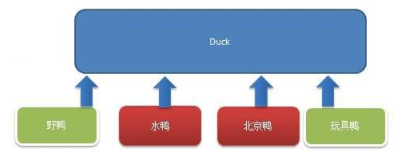
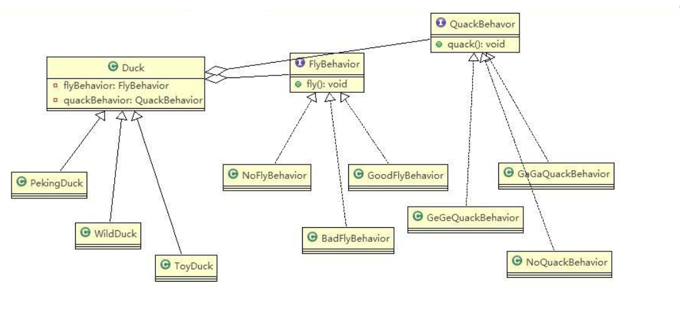

# Strategy Mode

> 鸭子展示项目

1. 有各种鸭子(比如 野鸭、北京鸭、水鸭等， 鸭子有各种行为，比如 叫、飞行等)
2. 显示鸭子的信息

---

> 传统方案解决鸭子展示项目

原理类图：



代码实现：

```java
package pers.ditto.traditional;

/**
 * @author OrangeCH3
 * @create 2021-08-01 19:06
 */

@SuppressWarnings("all")
public abstract class Duck {

    public Duck() {

    }

    public abstract void display(); //显示鸭子信息

    public void quack() {
        System.out.println("鸭子嘎嘎叫");
    }

    public void swim() {
        System.out.println("鸭子会游泳");
    }

    public void fly() {
        System.out.println("鸭子会飞翔");
    }
}
```

```java
package pers.ditto.traditional;

/**
 * @author OrangeCH3
 * @create 2021-08-01 19:07
 */

@SuppressWarnings("all")
public class PekingDuck extends Duck{

    @Override
    public void display() {
        System.out.println("北京鸭");
    }

    //因为北京鸭不能飞翔，因此需要重写fly
    @Override
    public void fly() {
        System.out.println("北京鸭不能飞翔");
    }
}
```

```java
package pers.ditto.traditional;

/**
 * @author OrangeCH3
 * @create 2021-08-01 19:08
 */

@SuppressWarnings("all")
public class ToyDuck extends Duck{

    @Override
    public void display() {
        System.out.println("玩具鸭");
    }

    //需要重写父类的所有方法
    @Override
    public void quack() {
        System.out.println("玩具鸭不能叫");
    }
    @Override
    public void swim() {
        System.out.println("玩具鸭不会游泳");
    }
    @Override
    public void fly() {
        System.out.println("玩具鸭不会飞翔");
    }
}
```

```java
package pers.ditto.traditional;

/**
 * @author OrangeCH3
 * @create 2021-08-01 19:09
 */

@SuppressWarnings("all")
public class WildDuck extends Duck{

    @Override
    public void display() {
        System.out.println("这是野鸭");
    }
}
```

```java
package pers.ditto.traditional;

import org.junit.Test;

/**
 * @author OrangeCH3
 * @create 2021-08-01 19:10
 */

@SuppressWarnings("all")
public class ClientTrad {

    @Test
    public void testTrad() {

        Duck pekingDuck = new PekingDuck();
        pekingDuck.display();
        pekingDuck.fly();
        pekingDuck.quack();
        pekingDuck.swim();
        System.out.println();

        Duck toyDuck = new ToyDuck();
        toyDuck.display();
        toyDuck.fly();
        toyDuck.quack();
        toyDuck.swim();
        System.out.println();

        Duck wildDuck = new WildDuck();
        wildDuck.display();
        wildDuck.fly();
        wildDuck.quack();
        wildDuck.swim();
        System.out.println();
    }
}
```

问题分析：

1. 其它鸭子，都继承了 Duck 类，所以 fly 让所有子类都会飞了，这是不正确的
2. 上面说的 1 的问题，其实是继承带来的问题：对类的局部改动，尤其超类的局部改动，会影响其他部分。会有溢出效应
3. 为了改进 1 问题，我们可以通过覆盖 fly 方法来解决 → 覆盖解决
4. 问题又来了，如果我们有一个玩具鸭子 ToyDuck, 这样就需要 ToyDuck 去覆盖 Duck 的所有实现的方法 → 解决思路 -》 策略模式 (strategy pattern)

---

> 策略模式解决鸭子展示项目

基本介绍：

1. 策略模式（Strategy Pattern）中，定义算法族（策略组），分别封装起来，让他们之间可以互相替换，此模式让算法的变化独立于使用算法的客户
2. 这算法体现了几个设计原则，第一、把变化的代码从不变的代码中分离出来；第二、针对接口编程而不是具体类（定义了策略接口）；第三、多用组合/聚合，少用继承（客户通过组合方式使用策略）

原理类图：



代码实现：

```java
package pers.ditto.strategy;

/**
 * @author OrangeCH3
 * @create 2021-08-01 19:20
 */

@SuppressWarnings("all")
public interface FlyBehavior {

    void fly(); // 子类具体实现
}
```

```java
package pers.ditto.strategy;

/**
 * @author OrangeCH3
 * @create 2021-08-01 19:21
 */

@SuppressWarnings("all")
public class GoodFlyBehavior implements FlyBehavior{

    @Override
    public void fly() {
        System.out.println("飞翔技术高超");
    }
}
```

```java
package pers.ditto.strategy;

/**
 * @author OrangeCH3
 * @create 2021-08-01 19:23
 */

@SuppressWarnings("all")
public class NoFlyBehavior implements FlyBehavior{

    @Override
    public void fly() {
        System.out.println("不会飞翔");
    }
}
```

```java
package pers.ditto.strategy;

/**
 * @author OrangeCH3
 * @create 2021-08-01 19:23
 */

@SuppressWarnings("all")
public class BadFlyBehavior implements FlyBehavior{

    @Override
    public void fly() {
        System.out.println("飞翔技术一般");
    }
}
```

```java
package pers.ditto.strategy;

/**
 * @author OrangeCH3
 * @create 2021-08-01 19:25
 */

@SuppressWarnings("all")
public interface QuackBehavior {

    void quack();//子类实现
}
```

```java
package pers.ditto.strategy;

/**
 * @author OrangeCH3
 * @create 2021-08-01 19:25
 */

@SuppressWarnings("all")
public abstract class Duck {

    //属性, 策略接口
    FlyBehavior flyBehavior;
    //其它属性<->策略接口
    QuackBehavior quackBehavior;

    public Duck() {

    }

    public abstract void display();//显示鸭子信息

    public void quack() {
        System.out.println("鸭子嘎嘎叫");
    }

    public void swim() {
        System.out.println("鸭子会游泳");
    }

    public void fly() {

        //改进
        if(flyBehavior != null) {
            flyBehavior.fly();
        }
    }

    public void setFlyBehavior(FlyBehavior flyBehavior) {
        this.flyBehavior = flyBehavior;
    }


    public void setQuackBehavior(QuackBehavior quackBehavior) {
        this.quackBehavior = quackBehavior;
    }
}
```

```java
package pers.ditto.strategy;

/**
 * @author OrangeCH3
 * @create 2021-08-01 19:25
 */

@SuppressWarnings("all")
public class PekingDuck extends Duck{

    //假如北京鸭可以飞翔，但是飞翔技术一般
    public PekingDuck() {
        flyBehavior = new BadFlyBehavior();

    }

    @Override
    public void display() {
        System.out.println("北京鸭");
    }
}
```

```java
package pers.ditto.strategy;

/**
 * @author OrangeCH3
 * @create 2021-08-01 19:27
 */

@SuppressWarnings("all")
public class ToyDuck extends Duck{

    public ToyDuck() {
        flyBehavior = new NoFlyBehavior();
    }

    @Override
    public void display() {
        System.out.println("玩具鸭");
    }

    //需要重写父类的所有方法

    public void quack() {
        System.out.println("玩具鸭不能叫");
    }

    public void swim() {
        System.out.println("玩具鸭不会游泳");
    }
}
```

```java
package pers.ditto.strategy;

/**
 * @author OrangeCH3
 * @create 2021-08-01 19:27
 */

@SuppressWarnings("all")
public class WildDuck extends Duck{

    //构造器，传入FlyBehavor 的对象
    public  WildDuck() {
        flyBehavior = new GoodFlyBehavior();
    }


    @Override
    public void display() {
        System.out.println("这是野鸭");
    }
}
```

```java
package pers.ditto.strategy;

import org.junit.Test;

/**
 * @author OrangeCH3
 * @create 2021-08-01 19:29
 */

@SuppressWarnings("all")
public class ClientStrategy {

    @Test
    public void testStrategy() {

        WildDuck wildDuck = new WildDuck();
        wildDuck.display();
        wildDuck.fly();
        wildDuck.quack();
        wildDuck.swim();
        System.out.println();

        ToyDuck toyDuck = new ToyDuck();
        toyDuck.display();
        toyDuck.fly();
        toyDuck.quack();
        toyDuck.swim();
        System.out.println();

        PekingDuck pekingDuck = new PekingDuck();
        pekingDuck.display();
        pekingDuck.fly();
        pekingDuck.quack();
        pekingDuck.swim();
        System.out.println();

        //动态改变某个对象的行为, 北京鸭 不能飞
        pekingDuck.setFlyBehavior(new NoFlyBehavior());
        System.out.println("北京鸭的实际飞翔能力");
        pekingDuck.fly();
    }
}
```

策略模式的注意事项和细节：

1. 策略模式的关键是：分析项目中变化部分与不变部分
2. 策略模式的核心思想是：多用组合/聚合 少用继承；用行为类组合，而不是行为的继承，更有弹性
3. 体现了“对修改关闭，对扩展开放”原则，客户端增加行为不用修改原有代码，只要添加一种策略（或者行为）即可，避免了使用多重转移语句（`if..else` `if..else`）
4. 提供了可以替换继承关系的办法： 策略模式将算法封装在独立的 Strategy 类中使得你可以独立于其 Context 改变它，使它易于切换、易于理解、易于扩展
5. 需要注意的是：每添加一个策略就要增加一个类，当策略过多是会导致类数目庞多
