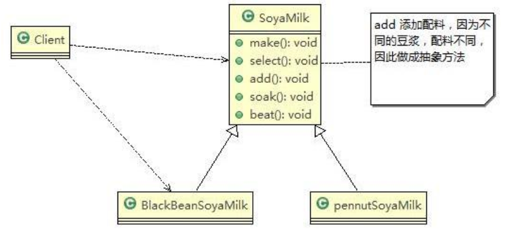

# Template Mode

> 豆浆制作问题

1. 制作豆浆的流程：选材 → 添加配料 → 浸泡 → 放到豆浆机打碎
2. 通过添加不同的配料，可以制作出不同口味的豆浆
3. 选材、浸泡和放到豆浆机打碎这几个步骤对于制作每种口味的豆浆都是一样的
4. 使用**模板方法模式**完成

---

> 模板方法模式解决豆浆制作问题

基本介绍：

1. 模板方法模式（Template Method Pattern）， 又叫模板模式(Template Pattern)， 在一个抽象类公开定义了执行它的方法的模板。它的子类可以按需要重写方法实现，但调用将以抽象类中定义的方式进行
2. 模板方法模式 定义一个操作中的算法的骨架，而将一些步骤延迟到子类中，使得子类可以不改变一个算法的结构，就可以重定义该算法的某些特定步骤
3. 这种类型的设计模式属于行为型模式

原理类图：



代码实现：

```java
package pers.ditto.template;

/**
 * @author OrangeCH3
 * @create 2021-07-23 10:37
 */

@SuppressWarnings("all")
public abstract class SoyaMilk {

    //模板方法, make , 模板方法可以做成final , 不让子类去覆盖.
    final void make() {

        select();
        if(customerWantCondiments()) {
            addCondiments();
        }
        soak();
        beat();
        System.out.println("制作完成啦");

    }

    //选材料
    void select() {
        System.out.println("制作前准备：选择上好的新鲜黄豆");
    }

    //添加不同的配料， 抽象方法, 子类具体实现
    abstract void addCondiments();

    //浸泡
    void soak() {
        System.out.println("正在制作中：黄豆和配料浸泡3小时");
    }

    void beat() {
        System.out.println("正在制作中：黄豆和配料放到豆浆机去打碎");
    }

    //钩子方法，决定是否需要添加配料
    boolean customerWantCondiments() {
        return true;
    }
}
```

```java
package pers.ditto.template;

/**
 * @author OrangeCH3
 * @create 2021-07-23 10:48
 */

@SuppressWarnings("all")
public class RedBeanSoyaMilk extends SoyaMilk{

    @Override
    void addCondiments() {
        System.out.println("制作前准备：选择上好的红豆配料");
    }
}
```

```java
package pers.ditto.template;

/**
 * @author OrangeCH3
 * @create 2021-07-23 10:49
 */

@SuppressWarnings("all")
public class PeanutSoyaMilk extends SoyaMilk{

    @Override
    void addCondiments() {
        System.out.println("制作前准备：选择上好的花生配料");
    }
}
```

```java
package pers.ditto.template;

/**
 * @author OrangeCH3
 * @create 2021-07-23 10:50
 */

@SuppressWarnings("all")
public class PureSoyaMilk extends SoyaMilk{

    @Override
    void addCondiments() {
        // 空实现，不加配料
    }

    @Override
    boolean customerWantCondiments() {
        return false;
    }
}
```

```java
package pers.ditto.template;

import org.junit.Test;

/**
 * @author OrangeCH3
 * @create 2021-07-23 10:51
 */

@SuppressWarnings("all")
public class ClientTemplate {

    @Test
    public void testTemplate() {

        SoyaMilk redBeanSoyaMilk = new RedBeanSoyaMilk();
        redBeanSoyaMilk.make();
        System.out.println();

        SoyaMilk peanutSoyaMilk = new PeanutSoyaMilk();
        peanutSoyaMilk.make();
        System.out.println();

        SoyaMilk pureSoyaMilk = new PureSoyaMilk();
        pureSoyaMilk.make();
    }
}
```

模板方法模式的注意事项和细节：

1. 算法只存在于一个地方，也就是在父类中，容易修改。需要修改算法时，只要修改父类的模板方法或者已经实现的某些步骤，子类就会继承这些修改
2. 实现了最大化代码复用。父类的模板方法和已实现的某些步骤会被子类继承而直接使用
3. 既统一了算法，也提供了很大的灵活性。父类的模板方法确保了算法的结构保持不变，同时由子类提供部分步骤的实现
4. 该模式的不足之处：每一个不同的实现都需要一个子类实现，导致类的个数增加，使得系统更加庞大
5. 一般模板方法都加上 final 关键字， 防止子类重写模板方法
6. 当要完成在某个过程，该过程要执行一系列步骤，这一系列的步骤基本相同，但其个别步骤在实现时可能不同，通常考虑用模板方法模式来处理
