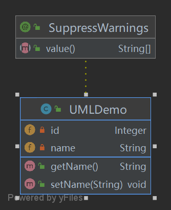
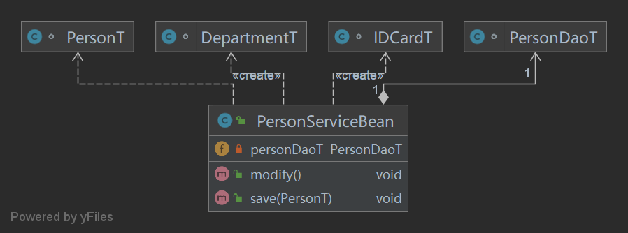
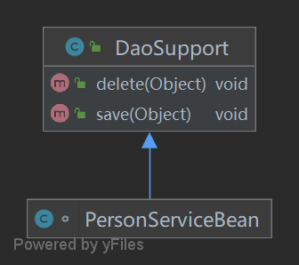
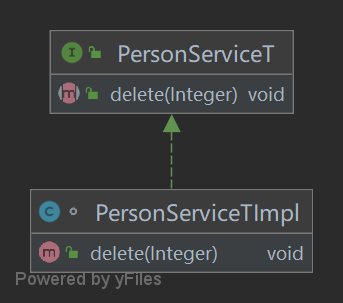
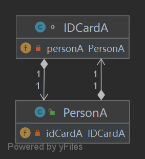
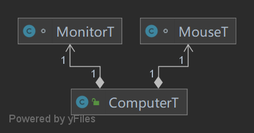
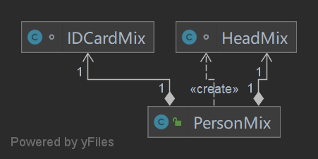

# UML Class Diagram

> UML 基本介绍

1. UML——Unified modeling language UML (统一建模语言)，是一种用于软件系统分析和设计的语言工具，它用于帮助软件开发人员进行思考和记录思路的结果
2. UML 本身是一套符号的规定，就像数学符号和化学符号一样，这些符号用于描述软件模型中的各个元素和他们之间的关系，比如类、接口、实现、泛化、依赖、组合、聚合等

3. 使用 UML 来建模，常用的工具有 Rational Rose ，也可以使用一些插件来建模

---

> UML 类图

1. 用于描述系统中的类(对象)本身的组成和类(对象)之间的各种静态关系
2. 类之间的关系：依赖、泛化（继承）、实现、关联、聚合与组合

类图简单举例：

```java
package pers.ditto.demo;

/**
 * @author OrangeCH3
 * @create 2021-07-09 14:07
 */

@SuppressWarnings("all")
public class UMLDemo {

    private Integer id;
    private String name;

    public void setName(String name) {
        this.name=name;
    }

    public String
    getName() {
        return name;
    }
}
```



---

> 类图—依赖关系（Dependence）

只要是在类中用到了对方，那么他们之间就存在依赖关系。如果没有对方，连编绎都通过不了

```java
package pers.ditto.uml.dependence;

/**
 * @author OrangeCH3
 * @create 2021-07-09 14:14
 */

@SuppressWarnings("all")
public class PersonServiceBean {

    private PersonDaoT personDaoT;

    public void save(PersonT personT) {}

    public void modify(){
        DepartmentT departmentT = new DepartmentT();
        IDCardT idCardT = new IDCardT();
    }


}

class PersonDaoT{}

class IDCardT{}

class PersonT{}

class DepartmentT{}

```



小结：

1. 类中用到了对方
2. 如果是类的成员属性
3. 如果是方法的返回类型
4. 是方法接收的参数类型
5. 方法中使用到

---

> 类图—泛化关系（Generalization）

泛化关系实际上就是继承关系，他是依赖关系的特例

```java
package pers.ditto.uml.generalization;

/**
 * @author OrangeCH3
 * @create 2021-07-09 14:27
 */

@SuppressWarnings("all")
public class DaoSupport {

    public void save(Object entity){

    }

    public void delete(Object entity){

    }
}

class PersonServiceBean extends DaoSupport{

}
```



小结：

1. 泛化关系实际上就是继承关系
2. 如果 A 类继承了 B 类，我们就说 A 和 B 存在泛化关系

---

> 类图—实现关系（Implementation）

实现关系实际上就是 A 类实现 B 接口，他是依赖关系的特例

```java
package pers.ditto.uml.implementation;

/**
 * @author OrangeCH3
 * @create 2021-07-09 14:35
 */

@SuppressWarnings("all")
public interface PersonServiceT {

    public void delete(Integer id);
}

class PersonServiceTImpl implements PersonServiceT {

    @Override
    public void delete(Integer id) {
        System.out.println("您删除了"+ id +"号");
    }
}
```



---

> 类图—关联关系（Association）

关联关系实际上就是类与类之间的联系，他是依赖关系的特例，关联具有导航性（双向/单向关系）和多重性

```java
package pers.ditto.uml.association;

/**
 * @author OrangeCH3
 * @create 2021-07-09 14:46
 */

// 双向关联
@SuppressWarnings("all")
public class PersonA {
    private IDCardA idCardA;
}

class IDCardA {
    private PersonA personA;
}
```



---

> 类图—聚合关系（Aggregation）

聚合关系（Aggregation）表示的是整体和部分的关系，整体与部分可以分开。聚合关系是关联关系的特例，所以他具有关联的导航性与多重性。

比如：一台电脑由键盘(keyboard)、显示器(monitor)，鼠标等组成；组成电脑的各个配件是可以从电脑上分离出来的，使用带空心菱形的实线来表示

```java
package pers.ditto.uml.aggregation;

/**
 * @author OrangeCH3
 * @create 2021-07-09 15:05
 */

@SuppressWarnings("all")
public class ComputerT {

    private MouseT mouseT;
    private MonitorT monitorT;
    
}

class MouseT {}

class MonitorT {}
```



---

> 类图—组合关系（Composition）

组合关系：也是整体与部分的关系，但是整体与部分不可以分开

在程序中我们定义实体： Person与 IDCard、 Head, 那么 Head 和 Person 就是 组合， IDCard和Person 就是聚合

```java
package pers.ditto.uml.composition;

/**
 * @author OrangeCH3
 * @create 2021-07-09 15:16
 */

@SuppressWarnings("all")
public class PersonMix {

    private IDCardMix card;
    private HeadMix head = new HeadMix();
}

class IDCardMix {}

class HeadMix {}
```



