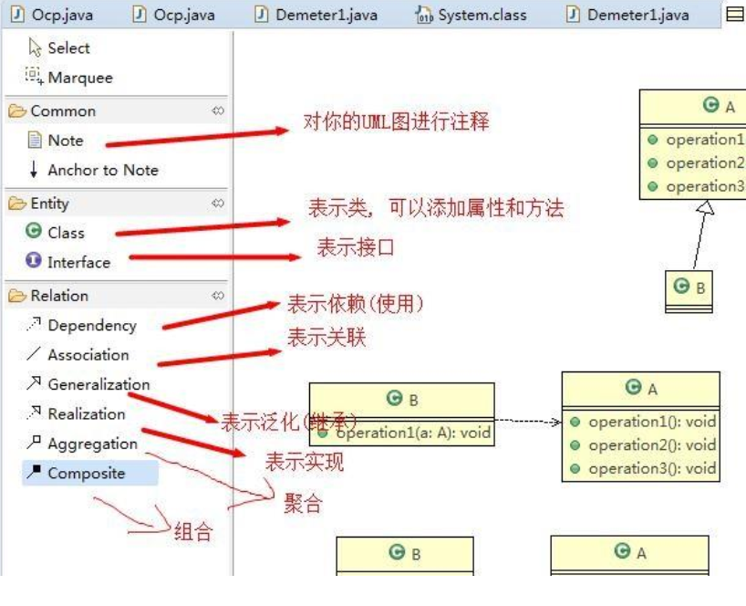

# UML Class Diagram

> UML 基本介绍

1. UML——Unified modeling language UML (统一建模语言)，是一种用于软件系统分析和设计的语言工具，它用于帮助软件开发人员进行思考和记录思路的结果
2. UML 本身是一套符号的规定，就像数学符号和化学符号一样，这些符号用于描述软件模型中的各个元素和他们之间的关系，比如类、接口、实现、泛化、依赖、组合、聚合等

3. 使用 UML 来建模，常用的工具有 Rational Rose ，也可以使用一些插件来建模

---

> UML 类图

1. 用于描述系统中的类(对象)本身的组成和类(对象)之间的各种静态关系
2. 类之间的关系：依赖、泛化（继承）、实现、关联、聚合与组合
3. 

