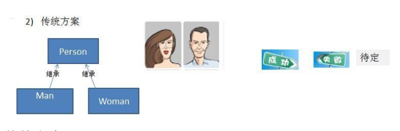
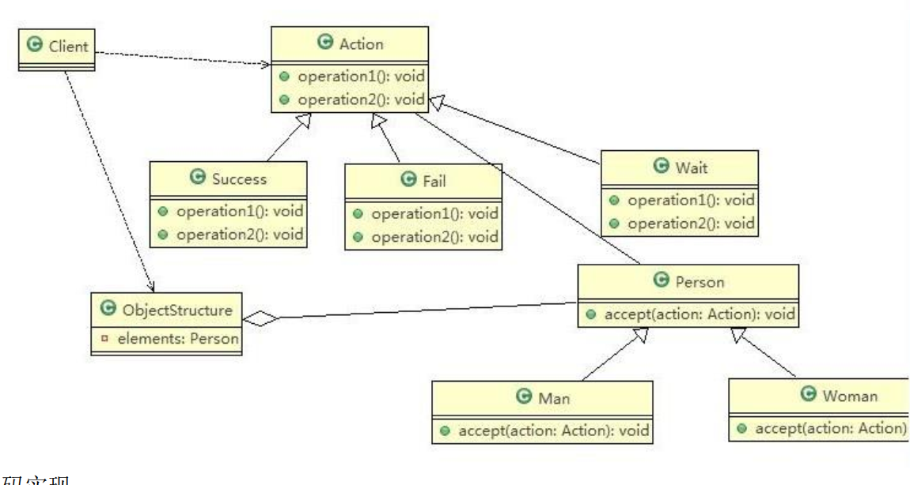

# Visitor Mode

> 测评系统项目的需求

将观众分为男人和女人，对歌手进行测评，当看完某个歌手表演后，得到他们对该歌手不同的评价(评价有不同的种类，比如 成功、失败 等)

---

> 传统方案解决测评系统项目



传统方式的问题分析：

1. 如果系统比较小，还是 ok 的，但是考虑系统增加越来越多新的功能时，对代码改动较大，违反了ocp 原则，不利于维护
2. 扩展性不好，比如增加了新的人员类型，或者管理方法，都不好做
3. 引出我们会使用新的设计模式 → 访问者模式

---

> 访问者模式解决测评系统项目

基本介绍：

1. 访问者模式（Visitor Pattern），封装一些作用于某种数据结构的各元素的操作，它可以在不改变数据结构的前提下定义作用于这些元素的新的操作
2. 主要将数据结构与数据操作分离，解决数据结构和操作耦合性问题
3. 访问者模式的基本工作原理是：在被访问的类里面加一个对外提供接待访问者的接口
4. 访问者模式主要应用场景是：需要对一个对象结构中的对象进行很多不同操作(这些操作彼此没有关联)，同时需要避免让这些操作"污染"这些对象的类，可以选用访问者模式解决

原理类图：



代码实现：

```java
package pers.ditto.visitor;

/**
 * @author OrangeCH3
 * @create 2021-07-24 18:20
 */

@SuppressWarnings("all")
public abstract class Person {

    //提供一个方法，让访问者可以访问
    public abstract void accept(Action action);
}
```

```java
package pers.ditto.visitor;

/**
 * @author OrangeCH3
 * @create 2021-07-24 18:20
 */

@SuppressWarnings("all")
public class Man extends Person{
    @Override
    public void accept(Action action) {
        action.getManResult(this);
    }
}
```

```java
package pers.ditto.visitor;

/**
 * @author OrangeCH3
 * @create 2021-07-24 18:21
 */

//说明
//1. 这里我们使用到了双分派, 即首先在客户端程序中，将具体状态作为参数传递Woman中(第一次分派)
//2. 然后Woman 类调用作为参数的 "具体方法" 中方法getWomanResult, 同时将自己(this)作为参数传入，完成第二次的分派
@SuppressWarnings("all")
public class Woman extends Person{
    @Override
    public void accept(Action action) {
        action.getWomanResult(this);
    }
}
```

```java
package pers.ditto.visitor;

/**
 * @author OrangeCH3
 * @create 2021-07-24 18:19
 */

@SuppressWarnings("all")
public abstract class Action {

    //得到男性 的测评
    public abstract void getManResult(Man man);

    //得到女的 测评
    public abstract void getWomanResult(Woman woman);
}
```

```java
package pers.ditto.visitor;

/**
 * @author OrangeCH3
 * @create 2021-07-24 18:22
 */
@SuppressWarnings("all")
public class Success extends Action{
    @Override
    public void getManResult(Man man) {
        System.out.println("男性观众举成功牌：歌手票数 +1 !");
    }

    @Override
    public void getWomanResult(Woman woman) {
        System.out.println("女性观众举成功牌：歌手票数 +1 !");
    }
}
```

```java
package pers.ditto.visitor;

/**
 * @author OrangeCH3
 * @create 2021-07-24 18:23
 */

@SuppressWarnings("all")
public class Fail extends Action{
    @Override
    public void getManResult(Man man) {
        System.out.println("男性观众举失败牌：歌手票数 -1 !");
    }

    @Override
    public void getWomanResult(Woman woman) {
        System.out.println("女性观众举失败牌：歌手票数 -1 !");
    }
}
```

```java
package pers.ditto.visitor;

/**
 * @author OrangeCH3
 * @create 2021-07-24 18:29
 */

@SuppressWarnings("all")
public class Wait extends Action{
    @Override
    public void getManResult(Man man) {
        System.out.println("男性观众举待定牌：歌手票数不变!");
    }

    @Override
    public void getWomanResult(Woman woman) {
        System.out.println("女性观众举待定牌：歌手票数不变!");
    }
}
```

```java
package pers.ditto.visitor;

import java.util.LinkedList;
import java.util.List;

/**
 * @author OrangeCH3
 * @create 2021-07-24 18:31
 */

@SuppressWarnings("all")
public class ObjectStructure {

    //维护了一个集合
    private List<Person> persons = new LinkedList<>();

    //增加到list
    public void attach(Person p) {
        persons.add(p);
    }
    //移除
    public void detach(Person p) {
        persons.remove(p);
    }

    //显示测评情况
    public void display(Action action) {
        for(Person p: persons) {
            p.accept(action);
        }
    }
}
```

```java
package pers.ditto.visitor;

import org.junit.Test;

/**
 * @author OrangeCH3
 * @create 2021-07-24 18:31
 */

@SuppressWarnings("all")
public class ClientVisitor {

    @Test
    public void testVisitor() {

        //创建ObjectStructure
        ObjectStructure objectStructure = new ObjectStructure();

        objectStructure.attach(new Man());
        objectStructure.attach(new Woman());

        //男女均给成功牌
        Success success = new Success();
        objectStructure.display(success);
        System.out.println();

        //男女均给失败牌
        Fail fail = new Fail();
        objectStructure.display(fail);
        System.out.println();

        //男女均给待定牌
        Wait wait = new Wait();
        objectStructure.display(wait);
    }
}
```

访问者模式的注意事项和细节：

1. 优点
   1. 访问者模式符合单一职责原则、让程序具有优秀的扩展性、灵活性非常高
   2. 访问者模式可以对功能进行统一，可以做报表、 UI、拦截器与过滤器，适用于数据结构相对稳定的系统
2. 缺点
   1. 具体元素对访问者公布细节，也就是说访问者关注了其他类的内部细节，这是迪米特法则所不建议的, 这样造成了具体元素变更比较困难
   2. 违背了依赖倒转原则。访问者依赖的是具体元素，而不是抽象元素
   3. 因此，如果一个系统有比较稳定的数据结构，又有经常变化的功能需求，那么访问者模式就是比较合适的